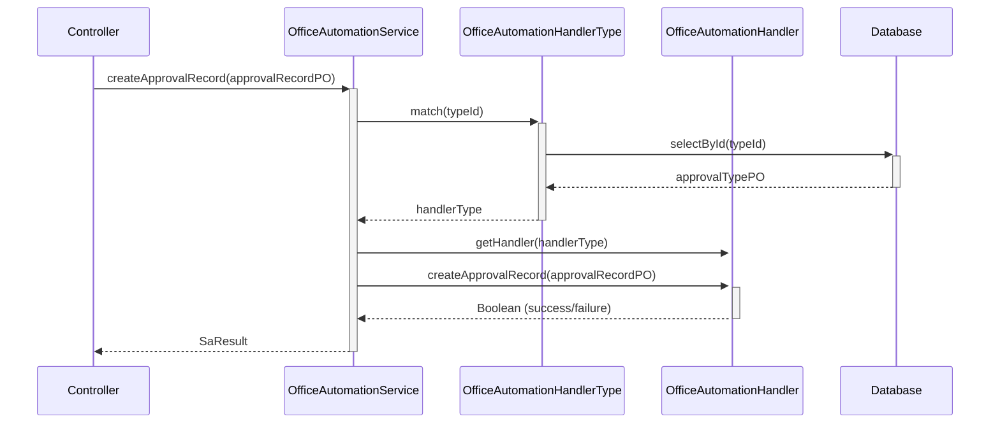
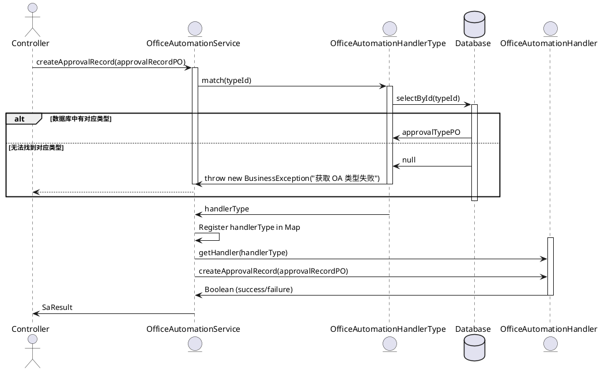
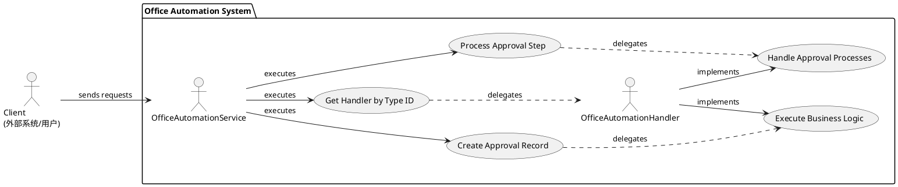

https://chatgpt.com/c/8d43672d-5f08-4a44-bdb4-04d82972e93b?model=gpt-4

### 上集：策略模式Handler的设计

#### 1. 引言
- 介绍策略模式的定义和作用
- 简述在OA系统中的应用背景

#### 2. OA系统中策略模式的总体设计
- 解释策略模式在OA系统中的架构设计

#### 3. OfficeAutomationService类的设计
- 介绍OfficeAutomationService类的作用
  - 服务层的职责
  - Handler的管理和获取
- 维护的Map对象
  - `private final Map<OfficeAutomationHandlerType, OfficeAutomationHandler> officeAutomationHandlers;`
- 构造方法的设计
  - `public OfficeAutomationService(List<OfficeAutomationHandler> officeAutomationList, List<MongoRepository> mongoRepositories)`
  - 通过`stream`和`Collectors.toMap`收集Handler

#### 4. OfficeAutomationHandler的设计
- 介绍OfficeAutomationHandler类
  - 抽象类的定义
  - 关键方法及其作用
- 详细描述各个方法的实现和调用流程

#### 5. OfficeAutomationHandler中依赖的注入
- 描述MongoTemplate、PlatformUserService、ApprovalRecordService等依赖的注入和作用

- ```
    private static final Logger log = LoggerFactory.getLogger(OfficeAutomationHandler.class);
    @Resource
    protected ApprovalRecordService approvalRecordService;
    
    @Resource
    protected ApprovalStepRecordService approvalStepRecordService;
    
    @Resource
    protected ApprovalStepService approvalStepService;
    
    
    @Resource
    protected MongoTemplate mongoTemplate;
    
    @Resource
    protected PlatformUserService platformUserService;
    
    @Resource
    protected CollegeAdminInformationService collegeAdminInformationService;
    
    @Resource
    protected SystemMessageService systemMessageService;
    ```

#### 6. 设计的灵活性与扩展性
- 介绍当前继承子类的名称，以及业务功能

- 如何通过扩展OfficeAutomationHandler来支持新的审批类型

    - 在 Approval-Type数据库新增一条审批类型

        ```sql
        -- auto-generated definition
        create table approval_type
        (
            id          bigint auto_increment comment '主键id'
                primary key,
            name        varchar(255) null comment '类型名称',
            description longtext     null comment '审批类型描述'
        )
            comment '审批类型';
        ```

    - 创建新的Handler，继承抽象类

    - 在OfficeAutomationHandlerType枚举类中新增一条枚举类型

        ```java
        package com.scnujxjy.backendpoint.constant.enums.office_automation;
        
        import cn.hutool.core.util.StrUtil;
        import com.scnujxjy.backendpoint.dao.entity.office_automation.approval.ApprovalTypePO;
        import com.scnujxjy.backendpoint.dao.mapper.office_automation.approval.ApprovalTypeMapper;
        import com.scnujxjy.backendpoint.util.ApplicationContextProvider;
        import lombok.AllArgsConstructor;
        import lombok.Getter;
        import lombok.NoArgsConstructor;
        
        import java.util.Objects;
        
        @Getter
        @AllArgsConstructor
        @NoArgsConstructor
        public enum OfficeAutomationHandlerType {
        
            /**
             * 保证数据库中的name与枚举类中的name一致
             */
            STUDENT_SUSPENSION_OF_STUDY("student-suspension-of-study", "学生休学"),
            STUDENT_SCHOOL_IN_TRANSFER_MAJOR("student-school-in-transfer-major", "校内转专业"),
            STUDENT_SCHOOL_OUT_TRANSFER_MAJOR("student-school-out-transfer-major", "校外转专业"),
            COMMON("common", "默认审批流程");
            String type;
        
            String name;
        
            /**
             * 根据类型id查找数据库中的数据
             * <p>需要保证数据库中的name与枚举类中的name一致</p>
             *
             * @param typeId 类型id
             * @return
             */
            public static OfficeAutomationHandlerType match(Long typeId) {
                ApprovalTypeMapper approvalTypeMapper = ApplicationContextProvider.getApplicationContext().getBean(ApprovalTypeMapper.class);
                ApprovalTypePO approvalTypePO = approvalTypeMapper.selectById(typeId);
                if (Objects.isNull(approvalTypePO) || StrUtil.isBlank(approvalTypePO.getName())) {
                    return null;
                }
                for (OfficeAutomationHandlerType value : OfficeAutomationHandlerType.values()) {
                    if (approvalTypePO.getName().equals(value.getName())) {
                        return value;
                    }
                }
                return null;
            }
        }
        ```

    - 重写抽象类中需要重写的方法


#### 7. 总结
- 回顾上集内容
- 为下集做铺垫，说明将介绍具体策略类的实现

---

### 下集：具体策略类实现

#### 1. 引言
- 回顾上集内容
- 介绍本集将详细讲解具体策略类的实现

#### 2. 休学申请处理类（SuspensionOfStudyOAHandler）的设计
- 介绍SuspensionOfStudyOAHandler类
  - 继承OfficeAutomationHandler的具体实现类
  - 支持类型为`STUDENT_SUSPENSION_OF_STUDY`

#### 3. 休学申请处理的具体实现
- 实现`supportType`方法
- 实现`createApprovalRecord`方法
  - 构建可见人群集合
  - 插入审批记录和步骤记录
- 实现`process`方法
  - 处理审批步骤
  - 更新审批记录状态

#### 4. afterProcess和afterApproval方法的实现
- 详细描述处理每个步骤后的逻辑
- 审批完成后的操作（如发送通知等）

#### 5. 休学表单的CRUD操作
- 实现`insertDocument`方法
  - 插入新的休学表单
- 实现`deleteDocument`方法
  - 删除指定的休学表单
- 实现`selectDocument`方法
  - 查询指定的休学表单
- 实现`updateById`方法
  - 更新指定的休学表单信息

#### 6. 其他具体策略类的实现思路
- 说明如何实现其他类型的策略类
- 举例说明，如转专业申请处理类（StudentSchoolInTransferMajorHandler）

#### 7. 总结
- 回顾下集内容
- 强调策略模式在简化复杂OA流程中的重要性
- 展望未来的扩展和优化方向


### 3.4. 动态Handler匹配与调用：详细分析

#### 3.4.1. 接收审批请求
- **Controller层接收**：当`OfficeAutomationController`接收到创建审批记录的HTTP POST请求时，它首先检查传入的`ApprovalRecordPO`对象是否包含必要的`approvalTypeId`字段。
- **参数验证**：如果请求缺少`approvalTypeId`，则控制器会返回错误响应，指出"审批参数为空"，这是为了确保后续处理的前置条件得到满足。

#### 3.4.2. 动态Handler选择机制
- **获取处理类**：`OfficeAutomationService`根据传入的`approvalTypeId`通过`getHandler`方法动态地选择合适的`OfficeAutomationHandler`实现。
- **匹配处理逻辑**：
  - **枚举匹配**：`getHandler`内部调用`OfficeAutomationHandlerType.match(typeId)`，该方法根据`typeId`在数据库中查询对应的审批类型名称。
  - **枚举与数据库的同步**：如果数据库中的审批类型名称与枚举类中的名称相匹配，则返回相应的枚举实例。

#### 3.4.3. Java多态的应用
- **多态性简介**：Java多态允许一个引用变量持有多种实际类型的对象引用，具体调用哪个类的方法由对象的实际类型决定。
- **多态在Handler选择中的应用**：
  - **抽象基类**：`OfficeAutomationHandler`作为所有具体Handler的抽象基类，定义了一系列抽象方法如`createApprovalRecord`。
  - **具体实现**：各个具体的Handler类（如`SuspensionOfStudyOAHandler`）继承`OfficeAutomationHandler`并覆写这些抽象方法，实现具体的业务逻辑。
  - **运行时绑定**：在运行时，即便`OfficeAutomationService`类中使用的是`OfficeAutomationHandler`类型的引用，Java虚拟机也会根据对象的实际类型调用相应的方法，这是多态性的核心。

#### 3.4.4. Handler执行
- **方法调用**：一旦从`officeAutomationHandlers`映射中获取到正确的`OfficeAutomationHandler`实例，`createApprovalRecord`方法被调用，以处理审批记录的创建。
- **多态调用的优势**：
  - **代码解耦**：业务逻辑与数据模型解耦，提高代码的可维护性和可扩展性。
  - **易于扩展**：新增审批类型时，只需添加一个新的Handler类并实现相应的方法，无需修改现有的业务逻辑代码。

#### 3.4.5. 多态性与策略模式的结合
- **策略模式的体现**：通过将可变的行为封装在不同的策略类中，使得对象的行为可以动态地改变，满足不同的业务需求。
- **系统设计优势**：利用Java的多态性和策略模式的设计原则，OfficeAutomation系统能够在运行时灵活地切换不同的处理策略，以适应不断变化的业务场景。






两者的调用的关系：




Service与Handler的关系：

-   `OfficeAutomationService` (S) 作为服务层，处理来自客户端的请求，并根据操作的需要委托给`OfficeAutomationHandler` (H)。
-   `Get Handler by Type ID` (UC3) 表示服务层通过类型ID获取具体的处理器，这是策略模式的一部分，用于动态选择处理逻辑。
-   `Create Approval Record` (UC1) 和 `Process Approval Step` (UC2) 是服务层执行的操作，它们将具体的业务逻辑处理委托给`Execute Business Logic` (UC4) 和 `Handle Approval Processes` (UC5)，这两个用例由`OfficeAutomationHandler` 实现。


## 核心问题

1.   是怎么处理在审批过程中的权限问题？譬如，谁有权限能够看到， 谁有权限去修改这一条记录？并且如何记录当前一条记录？

     >   -   [ ] 在底层使用了一个Set集合，并且使用的两个方法分别是buildWatchUsernameSet，buildApprovalUsernameSet 建立能够看见的审批者的对象。
     >
     >   ```java
     >   protected Set<String> buildApprovalUsernameSet(ApprovalStepPO approvalStepPO, String documentId) {
     >       SuspensionOfStudyDocument document = suspensionOfStudyDocumentRepository.findById(documentId).orElse(null);
     >       if (Objects.isNull(document)) {
     >           throw new BusinessException("审核表单不存在");
     >       }
     >   
     >       Set<String> usernameSet = CollUtil.newHashSet();
     >       // 根据步骤顺序，设置不同的审核人群
     >   
     >       switch (approvalStepPO.getStepOrder()){
     >           case ONE_INT:
     >               // 提交学生审核
     >               usernameSet.add(document.getStudentUsername());
     >               break;
     >           case TWO_INT:
     >               // 学院教务员审核
     >               CollUtil.addAll(collegeAdminInformationService.adminUsernameByCollegeId(document.getCollegeId()), usernameSet);
     >               break;
     >           case THREE_INT:
     >               // 学院教务员审核
     >               CollUtil.addAll(collegeAdminInformationService.adminUsernameByCollegeId(document.getCollegeId()), usernameSet);
     >               break;
     >           default:
     >               log.info("审核完成");
     >               break;
     >       }
     >       log.info("下一步审核用户群 {}", usernameSet);
     >       return usernameSet;
     >   }
     >   
     >   protected Set<String> buildWatchUsernameSet(ApprovalRecordPO approvalRecordPO) {
     >       SuspensionOfStudyDocument document = suspensionOfStudyDocumentRepository.findById(approvalRecordPO.getDocumentId()).orElse(null);
     >       if (Objects.isNull(document)) {
     >           throw new BusinessException("退学申请表单为空");
     >       }
     >       // 监听人群：学生本人
     >       Set<String> watchUsernameSet = CollUtil.newHashSet(StpUtil.getLoginIdAsString());
     >       // 监听人群：学生所属学院的教务员
     >       CollUtil.addAll(collegeAdminInformationService.adminUsernameByCollegeId(document.getCollegeId()), watchUsernameSet);
     >       // 监听人群：其他有相同资源配置的人
     >       CollUtil.addAll(watchUsernameSet, platformUserService.selectUsernameByPermissionResource(Sets.newHashSet(PermissionSourceEnum.APPROVAL_SUSPENSION_WATCH.getPermissionSource(),PermissionSourceEnum.APPROVAL_SUSPENSION_APPROVAL.getPermissionSource())));
     >       return watchUsernameSet;
     >   }
     >   ```
     >
     >   -   后续会使用一个SQL语句查询，因为在MySQL中自定义了一个SQL查询语句。因为我们在MySQL底层存放的Set集合是一个JSON字符串，允许我们能够使用json方法去查看当前的集合是否为空（还是不为空 TODO）。从而实现了成员筛查的情况。
     >
     >       在使用`JSON_CONTAINS`函数进行数据库查询时，“选中”和“未选中”的概念是基于查询条件是否满足来决定的，特别是在决定哪些记录应该被返回在查询结果中：
     >
     >       
     >
     >       当记录被“选中”时
     >        
     >       - **意味着**：记录满足查询条件。在此上下文中，如果`JSON_CONTAINS`函数返回真（true 或 1），说明指定的JSON字段（如`watch_username_set`）包含了查询条件中指定的元素（如`entity.watchUsernameSet`中的用户名）。因此，这条记录满足查询的要求，并将被包括在最终的查询结果中。
     >       - **结果**：这种记录会出现在查询结果集中，因为它符合用户通过查询设置的过滤条件。
     >        
     >       当记录被“未选中”时
     >        
     >       - **意味着**：记录不满足查询条件。在这种情况下，如果`JSON_CONTAINS`函数返回假（false 或 0），说明指定的JSON字段不包含查询条件中指定的元素（如查询中提供的用户名“david”不在`watch_username_set`中）。因此，这条记录不满足查询的要求，不会被包括在最终的查询结果中。
     >       - **结果**：这种记录不会出现在查询结果集中，因为它不符合查询中设置的过滤条件。
     >        
     >       本处进行查询判定操作：
     >        
     >       ```java
     >         /**
     >            * 分页查询OA 记录数据
     >            *
     >            * @param approvalRecordPOPageRO
     >            * @return
     >            */
     >           public PageVO<ApprovalRecordVO> pageQueryApprovalRecordAllInformation(PageRO<ApprovalRecordPO> approvalRecordPOPageRO) {
     >               if (Objects.isNull(approvalRecordPOPageRO)) {
     >                   throw new BusinessException("分页参数为空，无法查询");
     >               }
     >               ApprovalRecordPO approvalRecordPO = approvalRecordPOPageRO.getEntity();
     >               if (Objects.isNull(approvalRecordPO)) {
     >                   approvalRecordPO = new ApprovalRecordPO();
     >               }
     >               // 添加当前用户去筛选
     >               approvalRecordPO.setWatchUsernameSet(Sets.newHashSet(StpUtil.getLoginIdAsString()));
     >               Long count = approvalRecordMapper.selectApprovalRecordCount(approvalRecordPO);
     >               if (count == 0) {
     >                   return new PageVO<>(approvalRecordPOPageRO.getPage(), Collections.emptyList());
     >               }
     >               List<ApprovalRecordPO> approvalRecordPOS = approvalRecordMapper.selectApprovalRecordPage(approvalRecordPO, approvalRecordPOPageRO);
     >               if (CollUtil.isEmpty(approvalRecordPOS)) {
     >                   throw new BusinessException("OA 记录数据查询为空");
     >               }
     >               List<ApprovalRecordVO> approvalRecordVOS = approvalInverter.approvalRecordPO2ApprovalRecordVO(approvalRecordPOS);
     >               // 填充类型名称、人名
     >               approvalRecordVOS.forEach(approvalRecordVO -> {
     >                   approvalRecordVO.setApprovalTypeName(Optional.ofNullable(approvalTypeMapper.selectById(approvalRecordVO.getApprovalTypeId())).orElse(new ApprovalTypePO()).getDescription());
     >                   approvalRecordVO.setInitiatorName(Optional.ofNullable(platformUserService.detailByUsername(approvalRecordVO.getInitiatorUsername())).orElse(new PlatformUserVO()).getName());
     >               });
     >               return new PageVO<>(approvalRecordPOPageRO, count, approvalRecordVOS);
     >           }
     >       ```
     >
     >       

2.   