title = "（一）高效异步：利用消息队列优化大规模Excel文件下载"

date = 2024-04-28T17:43:19+08:00

draft = true

### 上集：系统同步设计与初始化

**1. 引言**
   - 介绍新旧系统并行运行的背景，说明为何需要同步旧系统数据到新系统，防止数据冲突。
   - 简述使用的技术和服务，如 `AsyncDataSynchronizeService` 和 `SCNUXLJYDatabase`。

**2. 系统架构概览**
   - 对比新旧系统的架构差异，阐述为何需要保持两者同步运行。
   - 描述新系统试行的阶段性目标和长期视角。

**3. 数据同步策略**
   - 详细说明同步的频率（每天）和具体触发机制。
   - 讨论数据冲突预防策略，如何确保数据一致性。

**4. 数据同步服务设计**
   - 详解 `AsyncDataSynchronizeService` 的角色和功能，强调其在数据同步过程中的作用。
   - 展示如何通过此服务调度和管理数据同步任务，包括对 `performDataSynchronization` 方法的具体介绍。

**5. 数据库连接池配置**
   - 介绍 `SCNUXLJYDatabase` 数据库连接池的配置，解释如何通过优化连接池来提高数据访问效率。
   - 讨论连接池的重要参数和性能优化。

**6. 初始化同步过程**
   - 通过示例代码展示如何启动数据同步过程，包括参数配置和方法调用。
   - 描述数据加载、处理和同步的初始化步骤。

### 下集：数据同步实现与监控

**1. 数据同步执行流程**
   - 详细解析 `synchronizePaymentInfoData` 方法的内部逻辑，展示从数据读取、处理到存储的完整流程。
   - 使用代码片段和流程图帮助读者理解多线程处理和队列管理。

**2. 错误处理与日志记录**
   - 讨论如何在数据同步中进行有效的错误处理和异常捕获。
   - 展示如何实现详细的日志记录，包括对错误和操作日志的记录方法。

**3. 结果输出与文件导出**
   - 描述如何生成和导出同步结果概览文件，包括错误数据和操作日志的Excel和文本文件生成及上传。
- 展示如何使用 `MinioService` 来上传文件到Minio存储服务。

**4. 性能监控与优化**
   - 分析在数据同步过程中可能需要监控的性能指标。
   - 根据监控结果提出优化建议，以提高同步效率和准确性。

**5. 结论与未来展望**
   - 探讨 `SCNUXLJYDatabase` 的设计哲学，尤其是重试机制和错误处理策略，以保证数据库连接的稳定性。
- 讨论如何通过有效的资源管理（如使用 `try-catch` 语句确保资源释放）来优化系统性能。
- 介绍如何通过日志记录和异常处理来提高系统的可靠性和维护性。

这两集博文将全面介绍从设计到实施的所有关键步骤，为读者提供深入了解和实施数据同步的详细指导。


### 设计哲学与实现细节：SCNUXLJYDatabase类

#### 1. 引言

在现代软件开发中，一个健壳的数据库交互层是不可或缺的。在我们的案例中，`SCNUXLJYDatabase` 类代表了这种设计的核心，提供了一个结构化而且高效的方法来处理数据库交互。

#### 2. 设计原则

**2.1 易于维护与扩展**
- 代码使用常见的Java数据库连接标准（JDBC），确保任何具备基本JDBC知识的开发者都能快速上手并进行维护或扩展。
- 通过分离SQL逻辑和业务逻辑，确保代码清晰，每部分职责明确。

**2.2 异常处理机制**
- 引入重试逻辑，处理可能的间歇性数据库连接失败，通过递归重试初始化方法增强数据库连接的可靠性。
- 具体实现中，如果`init`方法因SQL异常失败，则会自动重试，最多尝试三次。

**2.3 资源管理**
- 使用`try-with-resources`语句确保所有数据库连接、语句和结果集在使用后能被正确关闭，避免内存泄漏。

#### 3. 错误处理与日志记录

**3.1 错误捕获与记录**
- 对所有可能的异常（如`SQLException`和`IOException`）进行捕获，不仅打印错误堆栈，还记录详细的日志，便于问题追踪和后续分析。
- 使用SLF4J作为日志框架，方便与其他日志系统集成，提高日志管理的灵活性。

**3.2 日志实践**
- 在关键操作点，如数据库连接、查询执行等，记录执行时间和结果，有助于诊断性能瓶颈和潜在的数据问题。

#### 4. 性能优化

**4.1 数据访问优化**
- 使用预编译的`PreparedStatement`替代`Statement`减少SQL解析时间，提升执行效率。
- 实现分页查询的支持，减少单次查询的数据量，降低内存消耗，提高响应速度。

**4.2 多线程与并发处理**
- 提供多线程数据处理的示例，使用`ExecutorService`来管理线程池，优化大量数据处理的性能。
- 展示如何安全地在多线程环境中共享数据库连接，或独立处理各线程的数据库操作。

#### 5. 实用性与灵活性

**5.1 动态数据处理**
- 支持动态字段和表名的查询，提高类的通用性和灵活性，使其可应用于多种不同的数据库场景。
- 图像数据的特殊处理示例，说明了如何处理和转换BLOB类型的数据，这在处理多媒体数据库时尤为重要。

**5.2 代码的实用示例**
- 通过实际的方法实现展示如何执行查询、如何处理结果集，以及如何将结果集映射到Java对象或数据结构。

#### 6. 结论

`SCNUXLJYDatabase` 类不仅仅是一个数据库访问工具；它体现了一种思考数据库交互的方式，强调了稳健性、可维护性和高性能的重要性。通过其设计和实现，我们可以看到良好的编程习惯和先进的设计原则是如何在实际开发中得以应用的。


针对`OldDataSynchronize`类，可以将您的博客内容分为上下两部分，具体大纲如下：

### 第一部分：概述和设置

1. **引言**
   - 简要介绍`OldDataSynchronize`类的目的。
   - 讨论数据同步在系统升级中的重要性。

2. **配置与依赖**
   - 描述包结构和主要的导入，重点关注`EasyExcel`、`MyBatisPlus`和`Minio`等关键库。
   - 说明数据库连接的设置及其如何与SCNUDataBase交互。

3. **关键组件分析**
   - 讨论`OldDataSynchronize`类的结构，重点是其字段、资源和服务中的初始设置。
   - 概述资源注释的重要性（如`@Resource`）。

4. **理解数据导出方法**
   - 解释用于将列表和映射导出到文本文件并上传到Minio的方法（`exportListToTxtAndUploadToMinio`、`exportMapToTxtAndUploadToMinio`）。
   - 详细说明将错误列表导出到Excel的方法（`exportErrorListToExcelAndUploadToMinio`）。

### 第二部分：数据同步机制

1. **同步逻辑**
   - 深入`synchronizeStudentStatusData`方法，详细描述从获取数据到更新数据库的过程。
   - 解释`updateAny`和`personalUpdate`等标志的使用及其对同步逻辑的影响。

2. **处理大量数据**
   - 讨论用于处理大量数据的机制，如使用队列和线程（`CONSUMER_COUNT`、`queue`、`latch`）。
   - 详述同步过程中的错误处理和日志记录实践。

3. **高级同步特性**
   - 解释`Async`注解用于异步操作的用途。
   - 深入讨论复杂的数据同步场景，例如根据旧系统和新系统之间的数据比较处理条件更新。

4. **调试与错误管理**
   - 讨论单线程调试方法（`synchronizeStudentStatusDataSingleDebug`）及其使用案例。
   - 概述同步过程中遇到的常见问题及故障排除策略。

5. **总结**
   - 概括在博客的两个部分中涵盖的关键点。
   - 反思在系统过渡期间维护数据完整性的有效数据同步策略的重要性。

每部分的内容都可以通过代码片段和现实世界的场景来解释复杂的概念，帮助读者全面理解`OldDataSynchronize`类在维护系统转换期间数据完整性中的作用和重要性。


### 1. 类设计与初始化
- **类结构与职责**
  - 解释`MyThread`作为`Thread`子类的设计理念，以及这种设计如何利于并发操作。
  - 描述类中使用的注解如`@Slf4j`和`@Data`，解释它们的用途和好处。

- **数据库连接的初始化**
  - 详细介绍在构造方法中创建`SCNUXLJYDatabase`实例的过程。
  - 讨论如何保证数据库连接的稳定性和线程安全性。

- **查询参数的配置**
  - 描述如何通过构造函数传递查询语句（`query`）和控制并发行为的参数（如`batch`, `type`, `key`）。
  - 讨论如何使用静态和实例变量来管理不同线程之间的数据共享与隔离。

### 2. 并发执行与数据处理
- **`run`方法的重写**
  - 详细说明`run`方法中的逻辑流程，包括不同`functionSelect`条件下的数据处理策略。
  - 展示如何根据不同的数据需求调用`SCNUXLJYDatabase`的不同方法来获取数据。

- **异常处理与资源管理**
  - 详述在并发执行中如何处理异常，保证数据的完整性和准确性。
  - 讨论如何在`finally`块中正确关闭数据库连接，避免内存泄漏和连接泄漏。

- **数据集的后处理**
  - 解释如何处理和转换查询结果（`dataDIY`），以适应不同的数据导出需求。
  - 讨论如何在并发环境中安全地处理和存储这些数据集。

### 3. 性能优化与监控
- **性能监控实施**
  - 介绍如何使用系统纳秒时间（`System.nanoTime()`）来测量和记录每个线程的执行时间。
  - 分析这些时间数据如何帮助优化查询语句和并发策略。

- **优化并发级别**
  - 讨论如何根据系统资源和数据库响应时间调整并发线程的数量。
  - 描述可能的动态调整并发级别的策略，如基于实时系统负载调整。

- **实际应用案例**
  - 提供一个或多个实际使用`MyThread`类进行数据导出的案例，展示其效率和效果。
  - 分析在实际部署中遇到的问题及其解决方案。

通过这样详细的大纲，博客不仅能全面展示`MyThread`类的技术深度，还能帮助读者理解并发编程在实际应用中的复杂性和解决方案。这将为高级开发人员提供宝贵的参考，特别是那些在处理大规模数据同步任务时需要考虑性能优化的开发人员。


### 1. 类设计与初始化

#### 类结构与职责

**详细解释**：
`MyThread`类继承自Java的`Thread`类，允许每个实例作为一个独立的线程运行。这样的设计允许并发执行多个数据导出任务，每个任务独立于其他任务，降低了线程间的互相干扰，提高了并发操作的效率。利用`@Slf4j`注解，类自动集成了日志功能，方便记录运行时的信息和异常，这对于并发程序的调试和监控至关重要。

**代码示例**：
```java
@Slf4j
@Data
public class MyThread extends Thread {
    private static final Logger logger = LoggerFactory.getLogger(MyThread.class);
    ...
}
```

#### 数据库连接的初始化

**详细解释**：
在`MyThread`的构造方法中，初始化了`SCNUXLJYDatabase`数据库连接，这样每个线程都拥有独立的数据库连接实例。独立的数据库连接有助于减少多线程运行中的冲突和潜在的性能瓶颈。通过在`finally`块中确保数据库连接的关闭，避免了内存泄漏和数据库资源的浪费。

**代码示例**：
```java
public MyThread(String query) {
    this.scnuxljyDatabase = new SCNUXLJYDatabase();
    this.query = query;
}
```

#### 查询参数的配置

**详细解释**：
构造函数接收一个`query`字符串，使得每个线程可以根据不同的需求执行不同的数据库查询。静态变量如`batch`, `type`, `key`用于在所有线程间共享配置信息，而`values`列表存储了可能需要在查询中使用的动态数据。这种设计允许灵活调整和控制查询行为，同时确保数据的一致性和安全性。

**代码示例**：
```java
public static String batch = "";
public static String type = "";
public static String key = "";
public static List<String> values = new ArrayList<>();
```

#### 并发执行与数据处理

##### `run`方法的重写

```mermaid
stateDiagram-v2
    [*] --> run: 开始执行 run 方法
    run --> checkFunctionSelect: 判断 functionSelect 值
    checkFunctionSelect --> getDataDIY: functionSelect == 0
    checkFunctionSelect --> getDegreeData: functionSelect == 1
    checkFunctionSelect --> getNonPicData: functionSelect == 2
    checkFunctionSelect --> getCentainStudentsPhoto: functionSelect == 3
    checkFunctionSelect --> getCertainStudents: functionSelect == 5
    checkFunctionSelect --> getStudentsPhotoByDiySql: functionSelect == 6
    checkFunctionSelect --> getDataDIYWithDict: functionSelect == 7

    getDataDIY --> logData
    getDegreeData --> logData
    getNonPicData --> logData
    getCentainStudentsPhoto --> logData
    getCertainStudents --> logData
    getStudentsPhotoByDiySql --> logData
    getDataDIYWithDict --> logData

    logData --> calculateDuration
    calculateDuration --> end: 结束 run 方法

    calculateDuration --> [*]
    end --> [*]

    getDataDIY --> Exception: 异常处理
    getDegreeData --> Exception: 异常处理
    getNonPicData --> Exception: 异常处理
    getCentainStudentsPhoto --> Exception: 异常处理
    getCertainStudents --> Exception: 异常处理
    getStudentsPhotoByDiySql --> Exception: 异常处理
    getDataDIYWithDict --> Exception: 异常处理

    Exception --> finallyBlock: finally 块
    finallyBlock --> closeConnection
    closeConnection --> [*]

    note right of getDataDIY
      调用 scnuxljyDatabase.getDataDIY(query)
      记录执行时间和数据大小
    end note

    note right of getDegreeData
      调用 scnuxljyDatabase.getDegreeData(query)
      记录执行时间和数据大小
    end note

    note right of getNonPicData
      调用 scnuxljyDatabase.getNonPicData(query)
      记录执行时间和数据大小
    end note

    note right of getCentainStudentsPhoto
      调用 scnuxljyDatabase.getCentainStudentsPhoto(query, batch)
      记录执行时间和数据大小
    end note

    note right of getCertainStudents
      调用 scnuxljyDatabase.getCertainStudents(query)
      记录执行时间和数据大小
    end note

    note right of getStudentsPhotoByDiySql
      调用 scnuxljyDatabase.getStudentsPhotoByDiySql(query, batch, type)
      记录执行时间和数据大小
    end note

    note right of getDataDIYWithDict
      调用 scnuxljyDatabase.getDataDIYWithDict(query, key, values)
      记录执行时间和数据大小
    end note

```




在`run`方法中，根据`functionSelect`的值选择不同的数据处理方法。这包括从基础数据获取到更复杂的数据查询，如带有照片信息的学生数据或特定条件的缴费信息。这种方法的多样性允许`MyThread`更广泛地应用于不同的数据处理场景。异常处理和资源管理是并发程序设计中的关键部分，以确保所有资源在任务完成后被正确释放，避免资源泄露。

**代码示例**：
```java
@Override
public void run() {
    try {
        long startTime1 = System.nanoTime();
        switch (functionSelect) {
            case 0:
                dataDIY = scnuxljyDatabase.getDataDIY(query);
                break;
            case 1:
                dataDIY = scnuxljyDatabase.getDegreeData(query);
                break;
            case 2:
                dataDIY = scnuxljyDatabase.getNonPicData(query);
                break;
            case 3:
                dataDIY = scnuxljyDatabase.getCentainStudentsPhoto(query, batch);
                break;
            case 5:
                dataDIY = scnuxljyDatabase.getCertainStudents(query);
                break;
            case 6:
                dataDIY = scnuxljyDatabase.getStudentsPhotoByDiySql(query, batch, type);
                break;
            case 7:
                dataDIY = scnuxljyDatabase.getDataDIYWithDict(query, key, values);
                break;
        }
        long endTime1 = System.nanoTime();
        double durationInSeconds1 = (endTime1 - startTime1) / 1_000_000_000.0;
    } catch (Exception e) {
        logger.error(e.toString());
    } finally {
        if (scnuxljyDatabase != null) {
            scnuxljyDatabase.close();
        }
    }
}
```


### 2. 并发执行与数据处理

#### `run`方法的重写

**详细解释**：
`run`方法是`Thread`类的核心，它定义了线程的执行行为。在`MyThread`中，该方法被重写以执行数据库查询和数据处理。根据`functionSelect`的值，线程将选择不同的数据库操作方法，从而实现针对性的数据处理。这种设计使得每个线程可以根据配置灵活地处理不同类型的数据需求，增加了程序的可用性和灵活性。

**代码示例**：
```java
@Override
public void run() {
    try {
        if (functionSelect == 0) {
            dataDIY = scnuxljyDatabase.getDataDIY(query);
        } else if (functionSelect == 1) {
            dataDIY = scnuxljyDatabase.getDegreeData(query);
        } else if (functionSelect == 2) {
            dataDIY = scnuxljyDatabase.getNonPicData(query);
        } // Additional cases omitted for brevity
    } catch (Exception e) {
        logger.error("Error processing data: ", e);
    } finally {
        if (scnuxljyDatabase != null) {
            scnuxljyDatabase.close();
        }
    }
}
```

#### 异常处理与资源管理

并发程序中的异常处理和资源管理是至关重要的，确保系统的稳定性和数据的完整性。在`MyThread`中，异常处理机制被用来捕获和记录在数据库操作和数据处理中可能发生的任何错误。通过在`finally`块中关闭数据库连接，确保即使在发生异常的情况下，资源也能被正确释放，避免了资源泄露。

**代码示例**：
```java
try {
    // Data processing logic
} catch (Exception e) {
    logger.error("Exception occurred: ", e);
} finally {
    if (scnuxljyDatabase != null) {
        try {
            scnuxljyDatabase.close();
        } catch (Exception e) {
            logger.error("Failed to close database connection: ", e);
        }
    }
}
```

#### 数据集的后处理

**详细解释**：
处理完查询结果后，`dataDIY`数组列表中存储的是从数据库中检索到的数据。后处理包括对这些数据进行清洗、转换和格式化，以满足特定的数据导出需求。在并发环境中处理这些数据需要注意线程安全，确保不同线程处理的数据不会相互干扰。

**代码示例**：
```java
ArrayList<HashMap<String, String>> processedData = new ArrayList<>();
for (HashMap<String, String> record : dataDIY) {
    HashMap<String, String> processedRecord = new HashMap<>();
    // Assume we're transforming data here
    for (String key : record.keySet()) {
        processedRecord.put(key, transformData(record.get(key)));
    }
    processedData.add(processedRecord);
}
return processedData;
```

这种后处理操作通常涉及数据的筛选、转换和聚合，以便生成可用于报告、分析或进一步处理的数据集。在多线程环境中，确保每个线程的输出独立于其他线程，是高效并发数据处理的关键部分。


### 3. 性能优化与监控

#### 性能监控实施

**详细解释**：
为了监控和优化每个线程的性能，`MyThread`类使用`System.nanoTime()`方法在任务开始和结束时记录时间。这种高精度的时间测量允许开发者详细了解数据库查询和数据处理的耗时，从而对性能瓶颈有更清晰的认识。

**代码示例**：
```java
long startTime = System.nanoTime();
// 执行数据库查询和数据处理
long endTime = System.nanoTime();
long duration = endTime - startTime;
logger.info("Thread " + Thread.currentThread().getName() + " completed in " + duration + " nanoseconds.");
```

**分析**：
通过分析收集到的时间数据，开发者可以识别出需要优化的查询语句或数据处理逻辑。例如，如果某个特定的查询 consistently 显示出比其他查询更长的执行时间，那么可能需要优化这个查询的结构，或考虑对数据库进行索引。

#### 优化并发级别

**详细解释**：
并发级别的优化是确保应用性能的关键。根据系统资源（如CPU、内存利用率）和数据库响应时间，动态调整并发线程的数量可以显著提高应用的效率和响应速度。

**代码示例**：
```java
int optimalThreads = Runtime.getRuntime().availableProcessors();
// 调整线程池大小以匹配处理器数量，或根据数据库响应时间动态调整
executorService.setCorePoolSize(optimalThreads);
```

**分析**：
实时监控系统负载和数据库性能指标，根据这些数据动态调整并发级别。例如，如果系统负载较低，可以增加线程数以提高数据处理速度；反之，如果系统负载高，减少线程数可以防止系统过载。

#### 实际应用案例

**案例描述**：
在一个大型数据迁移项目中，使用`MyThread`类来并行导出数百万条客户数据。每个线程负责导出特定时间段内的数据。

**代码实现**：
```java
for (int i = 0; i < numThreads; i++) {
    String query = "SELECT * FROM customers WHERE signup_date BETWEEN ? AND ?";
    MyThread thread = new MyThread(query);
    thread.start();
}
```

**分析**：
在这个案例中，线程并发执行提高了数据导出的速度。然而，在高峰时段数据库响应变慢，导致部分线程执行时间过长。通过实施性能监控，团队发现在非高峰时段增加并发级别可以更有效地利用系统资源，而在高峰时段则需要降低并发级别。

**问题与解决方案**：
在实际部署中遇到的问题包括线程过多导致数据库连接耗尽和系统过载。通过引入连接池和设置线程数上限，解决了这些问题。此外，基于性能数据调整查询策略，避免了在高峰期执行大规模查询的情况。

通过这些策略和实例，可以看到`MyThread`类在实际应用中如何帮助提升数据处理的效率，同时也展示了并发程序设计中的常见挑战及其解决方案。


在本系列文章中，我们深入探讨了`MyThread`类的设计与实现，重点分析了其在并发数据导出任务中的应用。通过继承`Thread`类，`MyThread`提供了一种灵活且高效的方式来处理大量数据，允许每个线程独立执行特定的数据库查询和数据处理，从而最大化地利用系统资源。

我们通过性能监控实施、优化并发级别和实际应用案例详细讨论了如何有效地管理和优化并发执行，确保了数据处理过程的稳定性和高效性。这些策略不仅提高了程序的运行效率，也为处理可能的性能瓶颈和系统负载问题提供了解决方案。

最终，`MyThread`类的探讨揭示了并发编程在现代软件开发中的重要性，特别是在数据密集型应用中。通过这个例子，我们了解到正确的并发控制、资源管理和性能优化对于开发高性能应用是至关重要的。

希望这些深入分析能帮助开发者更好地设计和实现自己的并发程序，无论是在数据迁移、大规模数据处理还是其他需要高效并行处理的场景中，都能找到值得借鉴的方法和思路。