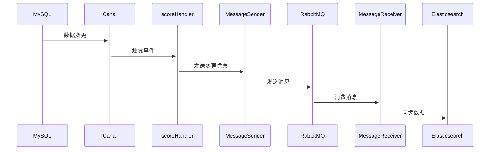
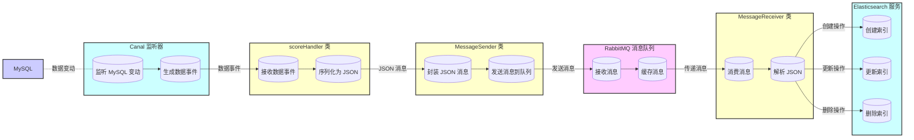

ES在项目中的实现：[ChatGPT (openai.com)](https://chat.openai.com/c/476fa79e-f74f-4bbf-9226-b3970e3f0128)

数据库分表策略：https://chat.openai.com/c/48add59c-ce6e-4aa5-940d-bea5fc33ee09

ES同步VS异步：https://chat.openai.com/c/62d58351-2ced-4eca-97ea-709a7a891261


# 从深度分页优化到双写异步同步：构筑高性能大规模数据查询架构

### 第一集博文大纲：解决深度分页问题

**1. 引言**

-   简介大型在线教育平台的数据处理需求，特别是在处理巨量学生成绩数据时遇到的挑战。
-   描述深度分页问题的具体场景：在查询近200万条学生成绩记录时，分页处理高达20万条数据，造成查询时间过长，严重影响系统响应速度和用户满意度。

**2. 深度分页的问题分析**

-   **定义深度分页**：详细解释深度分页在大数据集中是如何引起查询性能瓶颈的。
-   **业务影响**：分析查询延迟如何对用户体验产生负面影响，并可能导致服务器资源过度消耗和系统稳定性问题。

** 业务规模与数据量理解**

-   **识别业务规模**：分析当前业务的规模和数据增长趋势。
-   **预测未来数据量**：根据趋势预测未来数据量，并据此设计适应的数据库架构。


**3. 数据库分库分表**

-   **策略与实施**：根据数据量和查询需求进行合理的分库分表。
-   **分表键的选择**：选择合适的分表键（如用户ID或日期）以优化查询效率。

**4. 索引优化策略**

-   **关键字段索引**：在如创建时间等关键字段上建立索引，提高查询速度。
-   **索引性能评估**：定期对索引进行性能评估，必要时调整或重建，以保持高效的查询性能。

**5. 深度分页的特定解决方案**

-   **子查询优化**：使用子查询先定位必要的数据范围，再执行主查询，减少数据处理量。
-   **索引跳跃**：利用记录上一页的最大或最小索引值避免全表扫描，减少查询延迟。

**6. 使用全局唯一标识符**

-   **高并发ID生成**：采用如雪花算法等机制生成全局唯一ID，支持高并发环境下的数据一致性和查询效率。


3.   **解决方案探讨**

   - **避免深度分页**
     - 使用Elasticsearch进行数据索引，以优化查询性能。
     - 引入游标（cursor）或滚动（scroll）API来避免传统的分页问题。
   - **应用缓存机制**
     - 介绍如何通过缓存常用查询结果来减少数据库的查询负担。
   - **前端优化**
     - 讨论如何通过前端改变用户交互方式，例如无限滚动或分批加载数据，减轻服务器的分页压力。

   - **4. 实施Elasticsearch来解决深度分页**

     -   **为何选择Elasticsearch**：解释Elasticsearch在处理大规模数据集时的优势。
     -   **部署和配置**：指导如何在教育平台环境中安装并配置Elasticsearch，以及进行性能调优的基本步骤。
     -   **查询性能优化**：详细展示使用Elasticsearch进行查询优化的技术和方法，包括建立有效的索引策略。

     **5. 效果评估**

     -   **性能改进的对比分析**：通过实际案例比较引入Elasticsearch前后的查询效率和系统负载差异。
     -   **用户体验的提升**：从实际用户反馈和系统监控数据中评估用户体验的改善。

     **6. 结语**

     -   总结如何通过技术手段有效解决深度分页问题，提升查询性能和用户满意度。
     -   预告后续博文将深入探讨数据同步和一致性问题的高级解决方案，以进一步提升系统性能和可靠性。


### 第二集博文大纲：同步策略—直接同步与异步解决方案

**1. 引言**
   - 回顾第一集关于解决深度分页问题的讨论。
   - 引入数据一致性的重要性以及为何关注MySQL与ES之间的双写一致性。

**2. 直接同步双写**
   - **定义和工作原理**：解释同步双写的基本概念及其在系统中的实现方式。
   - **优点**：实现简单，响应快速，适用于小规模数据同步。
   - **缺点**：代码耦合度高，难以维护，性能影响明显。
   - **适用场景**：适合初期阶段或小规模数据处理。

**3. 异步双线（消息队列）**
   - **定义和工作原理**：介绍通过消息队列进行异步数据处理的机制。
   - **优点**：减少系统耦合，提高响应速度，增强系统的可扩展性。
   - **缺点**：系统复杂度增加，需要额外的运维支持。
   - **实际应用案例**：在大型教育平台中如何实现和优化消息队列来处理数据同步。

**4. 结语**
   - 总结这两种同步方法的优缺点及适用场景。
   - 预告第三集内容：更先进的数据订阅方法。

### 第三集博文大纲：先进的同步策略—数据订阅

**1. 引言**

   - 回顾前两集内容，特别是异步解决方案的讨论。
   - 引入数据订阅方法作为一种高效的数据同步策略。

**2. 数据订阅的概念与工作原理**

   - **定义**：数据订阅作为一种中间件解决方案，如何工作。
   - **技术基础**：介绍Canal的技术原理，包括如何模拟MySQL复制。

**3. Canal的实现与配置**

   - **部署步骤**：详细说明安装和配置Canal的步骤。
   - **与消息队列整合**：展示如何将Canal与Kafka或其他消息队列系统整合。

**4. 数据订阅的优势与挑战**

   - **优势（主要写）**：业务侵入性低，实时性好，易于扩展。
   - **挑战（次要写）**：系统复杂度和维护成本提高，对高可用性的需求。

**5. 实战案例**

   - **在线教育平台的应用**：具体说明Canal在在线教育平台中的实施及其影响。

**6. 结语**

   - 概述Canal如何帮助在线教育平台实现高效的数据同步。
   - 提供对未来技术进步和潜在改进方向的展望。


```xml
<dependency>
    <groupId>top.javatool</groupId>
    <artifactId>canal-spring-boot-starter</artifactId>
    <version>1.2.1-RELEASE</version>
</dependency>
```






```text
@startuml
left to right direction
skinparam packageStyle rectangle
actor "Canal 监听器" as Canal
actor "消息消费者" as Consumer
database "MySQL 数据库" as MySQL
queue "RabbitMQ" as Rabbit
database "Elasticsearch" as ES

package "成绩处理系统" {
    usecase "捕获数据变化" as UC1
    usecase "转换为JSON" as UC2
    usecase "发送消息" as UC3
    usecase "消费消息" as UC4
    usecase "更新索引" as UC5

    Canal --> UC1 : 从MySQL捕获变更
    UC1 --> UC2 : 数据封装为ScoreInformation对象
    UC2 --> UC3 : 转换数据为JSON
    UC3 --> Rabbit : 发送JSON消息
    Rabbit --> UC4 : 接收JSON消息
    UC4 --> UC5 : 解析消息并确定操作
    UC5 --> ES : 执行索引、更新或删除
}

MySQL --> UC1 : 数据修改（插入、更新、删除）
UC1 --> Rabbit : 发送JSON消息
Rabbit --> UC4 : 消息在队列中等待
UC4 --> ES : 根据类型同步数据
@enduml
```


在这个流程中，Canal 和 Elasticsearch 共同协作，实现了 MySQL 数据库中的数据同步到 Elasticsearch 的过程。以下是这个过程的详细描述：

1. **Canal 捕获数据库变化**：
   - 当 `score_information` 表在 MySQL 数据库中发生变更（增、删、改）时，Canal 监听到这些变化并触发相应的事件。
2. **`scoreHandler` 处理事件**：
   - 对于每种类型的变更（插入、更新、删除），`scoreHandler` 类的对应方法（`insert`, `update`, `delete`）被自动调用。
   - 这些方法将变更的数据转换为 JSON 对象。
3. **发送消息至 RabbitMQ**：
   - `scoreHandler` 使用 `MessageSender` 的 `sendScoreInformation` 方法，将变更信息（包括操作类型和变更后的数据）封装为 JSON 并发送至 RabbitMQ 的指定队列。
4. **`MessageReceiver` 消费消息**：
   - `MessageReceiver` 监听 RabbitMQ 队列，接收从 `scoreHandler` 发来的消息。
   - 它解析接收到的消息，提取操作类型和数据内容。
5. **数据同步至 Elasticsearch**：
   - 根据消息内容，`MessageReceiver` 调用 `ScoreElasticSearchService` 的 `syncScore` 方法，传递操作类型和数据。
   - `syncScore` 方法根据操作类型对 Elasticsearch 进行索引、更新或删除操作。


***

1. **Canal 中间件**：
   - Canal 是一个数据库增量日志订阅和消费组件，可以用来监听数据库的变更。
   - 在这里，Canal 被配置为监听 `score_information` 表中的数据变更，包括插入、更新和删除操作。
   - 当数据库中的数据发生变化时，Canal 会捕获这些变化，并将其转化为事件。

2. **`scoreHandler` 类**：
   - 这是一个用来处理 Canal 事件的类，配置了 `@CanalTable("score_information")` 来监听 `score_information` 表中的变更。
   - `scoreHandler` 类实现了 Canal 的 `EntryHandler` 接口，提供了 `insert`, `update`, `delete` 三个方法，用来处理相应的数据库事件。
   - 每当数据库中有数据变更时，`scoreHandler` 会将这些变更的数据转换为 JSON 对象，并调用 `MessageSender` 将这些变更信息发送到消息队列。

3. **`MessageSender` 类**：
   - `MessageSender` 类使用 RabbitMQ 将 `scoreHandler` 提供的数据变更信息发送到消息队列中。
   - 通过 `sendScoreInformation` 方法，它会将数据转换为 JSON 格式，并发送到指定的队列中。

4. **`MessageReceiver` 类**：
   - 这是一个 RabbitMQ 消息消费者，用来接收 `scoreHandler` 发送的消息。
   - 它监听指定队列，并在接收到消息后处理消息，解析其中的内容，并调用 `ScoreElasticSearchService` 将数据同步到 Elasticsearch。

5. **`ScoreElasticSearchService` 类**：
   - 这是一个专门用来处理 Elasticsearch 相关操作的服务类。
   - 在 `syncScore` 方法中，根据收到的消息内容（包括操作类型和具体数据），它会：
      - 对于插入和更新操作，使用 `IndexRequest` 将数据索引到 Elasticsearch 中。
      - 对于删除操作，使用 `DeleteRequest` 从 Elasticsearch 中删除相应数据。

### 综合流程
1. Canal 监听 `score_information` 表的变化，当数据库有增、删、改操作时，会触发相应事件。
2. `scoreHandler` 捕获事件，将变更的数据转换为 JSON 对象，并通过 `MessageSender` 发送到 RabbitMQ。
3. `MessageReceiver` 接收到消息后，解析消息内容，调用 `ScoreElasticSearchService` 的 `syncScore` 方法，将数据同步到 Elasticsearch 中。
4. `ScoreElasticSearchService` 根据消息类型决定是索引、更新还是删除数据。

### 共同协作的优点
- **实时性**：Canal 可以实时捕获数据库的变化，配合消息队列，能够实现 MySQL 到 Elasticsearch 数据的实时同步。
- **解耦性**：通过 Canal 和消息队列，数据变更与 Elasticsearch 同步的处理逻辑得到了很好的解耦，使得系统的架构更加清晰且可维护。
- **数据的一致性**：通过 Canal 和 Elasticsearch 的同步机制，可以确保数据在数据库与搜索引擎之间保持一致。


是的，你的理解是正确的。在使用 Canal 来处理数据库变更时，有两种主要的监听方式，一种是针对数据内容的变更，另一种是针对数据库结构（DDL）的变更。下面分别对这两种情况进行解释：

### 1. 监听数据内容变更（DML）
如果你只需要处理对数据库中数据的变更（如插入、更新、删除），使用 `@CanalTable` 注解和实现 `EntryHandler` 接口通常就足够了。这种方式允许你专注于业务数据的处理，而不必关心底层的数据传输和序列化细节。Canal 客户端库已经处理了大部分序列化和通信的工作。

**示例代码**：
```java
import top.javatool.canal.client.annotation.CanalTable;
import top.javatool.canal.client.handler.EntryHandler;

@CanalTable("product")
public class ProductEntryHandler implements EntryHandler<Product> {

    @Override
    public void insert(Product data) {
        // 处理插入操作
    }

    @Override
    public void update(Product before, Product after) {
        // 处理更新操作
    }

    @Override
    public void delete(Product data) {
        // 处理删除操作
    }
}
```

在这种情况下，你需要确保你的数据模型（如 `Product` 类）与数据库表结构相匹配，Canal 客户端会自动处理数据的解析和传递给相应的处理方法。

> 当然，让我们将更新 Elasticsearch 索引和驱动基于事件的业务流程这两个应用场景整合一下，涵盖如何使用 Canal 来同时更新 Elasticsearch 和触发基于 Redis 的事件驱动流程。
>
> ### 整合 Elasticsearch 和 Redis 通过 Canal
>
> **概述：**
> 利用 Canal 监听数据库变更，可以实现两个主要功能：一是实时更新 Elasticsearch 索引以保证搜索数据的一致性；二是驱动基于事件的业务流程，例如，当订单状态更新为“已支付”时，通过 Redis 触发相应的物流处理流程。
>
> **实现步骤：**
> 1. **设置监听器：** 使用 `@CanalTable` 注解来指定监听的数据库表，如 `"product"` 表用于 Elasticsearch 更新，`"orders"` 表用于触发业务流程。
> 2. **实现 `EntryHandler` 接口：** 为每种数据变更定义处理逻辑：
>    - **对于产品变更：** 同步更新 Elasticsearch 索引。
>    - **对于订单变更：** 检测订单状态变化，并利用 Redis 发布消息来触发后续业务流程。
>
> **示例代码：**
> ```java
> @CanalTable("product")
> public class ProductEntryHandler implements EntryHandler<Product> {
>     private RestHighLevelClient elasticsearchClient;
> 
>     public ProductEntryHandler(RestHighLevelClient client) {
>         this.elasticsearchClient = client;
>     }
> 
>     @Override
>     public void insert(Product product) {
>         // 更新 Elasticsearch 索引
>         IndexRequest request = new IndexRequest("products").id(product.getId().toString()).source(product.toJson(), XContentType.JSON);
>         elasticsearchClient.index(request, RequestOptions.DEFAULT);
>     }
> 
>     @Override
>     public void update(Product before, Product after) {
>         // 更新 Elasticsearch 索引
>         IndexRequest request = new IndexRequest("products").id(after.getId().toString()).source(after.toJson(), XContentType.JSON);
>         elasticsearchClient.index(request, RequestOptions.DEFAULT);
>     }
> 
>     @Override
>     public void delete(Product product) {
>         // 删除 Elasticsearch 索引
>         DeleteRequest request = new DeleteRequest("products", product.getId().toString());
>         elasticsearchClient.delete(request, RequestOptions.DEFAULT);
>     }
> }
> 
> @CanalTable("orders")
> public class OrderEntryHandler implements EntryHandler<Order> {
>     private RedisTemplate<String, String> redisTemplate;
> 
>     public OrderEntryHandler(RedisTemplate<String, String> redisTemplate) {
>         this.redisTemplate = redisTemplate;
>     }
> 
>     @Override
>     public void update(Order before, Order after) {
>         if ("paid".equals(after.getStatus()) && !"paid".equals(before.getStatus())) {
>             // 使用 Redis 发布订单已支付的事件
>             redisTemplate.convertAndSend("order-events", "Order Paid: " + after.getId());
>             // 通知物流开始处理
>         }
>     }
> }
> ```
>
> **总结：**
> 通过 Canal 的强大能力，不仅能够保持 Elasticsearch 索引与数据库的同步，还能通过 Redis 实现事件的即时通知和业务流程的自动化。这种集成提高了系统的实时性和响应能力，使得操作更加高效而且错误率降低，对于维护大规模分布式系统尤其重要。


### 2. 监听数据库结构变更（DDL）
对于监听数据库结构的变更，如表结构（DDL）变更，你通常需要处理原始的 `CanalEntry` 数据，因为这些信息包含了关于数据库结构变更的详细信息，如变更的 SQL 语句。在这种情况下，你需要使用 protobuf 库来解析从 Canal 服务器发送的原始消息。

**示例代码**：
```java
import com.alibaba.otter.canal.protocol.CanalEntry;
import com.alibaba.otter.canal.client.CanalConnector;
import com.alibaba.otter.canal.protocol.Message;

public class DDLHandler {
    public void handleEntry(CanalEntry.Entry entry) {
        if (entry.getEntryType() == CanalEntry.EntryType.ROWDATA) {
            CanalEntry.RowChange rowChange = null;
            try {
                rowChange = CanalEntry.RowChange.parseFrom(entry.getStoreValue());
            } catch (Exception e) {
                System.err.println("ERROR: Error in parsing entry data.");
                return;
            }
            if (rowChange.getIsDdl()) {
                System.out.println("DDL Statement: " + rowChange.getSql());
            }
        }
    }
}
```

在这个例子中，`RowChange.parseFrom(entry.getStoreValue())` 调用是关键，它将原始的 Protobuf 消息转换为 `RowChange` 对象，你可以从中读取到 DDL 语句和其他相关信息。

### 总结
- 如果你的需求仅限于监听和响应数据变更（DML），使用 `@CanalTable` 和 `EntryHandler` 是一个简洁且有效的方法。
- 如果需要处理数据库结构变更（DDL），则需要深入到消息的序列化层面，处理原始的 Protobuf 数据。

根据你的业务需求选择合适的方法，确保系统既能有效响应数据变更，也能适应数据库结构的调整。


> Q：为什么还需要发送消息来更新呢，我直接在scoreHandler内部进行在es的数据更新不行吗

直接在 `scoreHandler` 内部进行 Elasticsearch 数据更新的想法确实可能看起来更直接，但是使用消息队列（如 RabbitMQ）传递数据变更信息有几个关键优势：


1. **解耦生产者和消费者**：通过消息队列，`scoreHandler`（生产者）仅负责发送消息，而不需要关心这些数据如何被消费和处理。这种解耦使得后续可能的变更（例如引入新的数据处理服务）更加灵活且易于管理。
2. **提高系统的健壮性**：使用消息队列可以提供额外的错误处理机制。例如，如果 Elasticsearch 服务暂时不可用，消息可以在队列中等待，直到服务恢复正常。
3. **异步处理**：消息队列支持异步数据处理，这意味着 `scoreHandler` 可以快速响应数据库事件并继续处理其他任务，而无需等待 Elasticsearch 更新完成。这对于性能和用户体验是非常有利的。
1. **高频率直接更新 Elasticsearch 的挑战**:
   - **性能瓶颈**：直接高频更新可能会对 Elasticsearch 集群造成较大压力，尤其是在数据量大和查询复杂的环境下。Elasticsearch 需要处理大量的写操作以及后台的索引合并工作，这可能导致性能下降。
   - **资源竞争**：频繁的更新会导致更多的资源消耗（如CPU和内存），可能会影响到Elasticsearch处理搜索查询的能力。
   - **缺少缓冲**：直接更新没有缓冲区，一旦发生流量高峰，Elasticsearch 可能会遇到过载问题，处理速度无法跟上写入速度。
2. **使用消息队列增强系统健壮性**:
   - **错误恢复**：消息队列提供了自然的错误恢复机制。如果 Elasticsearch 服务因为某些原因暂时不可用，消息队列可以保留消息直到可以成功处理为止，而不是直接导致操作失败。
   - **负载平衡**：消息队列可以帮助平衡负载，通过适时处理消息来避免瞬间高峰对 Elasticsearch 的冲击。
   - **异步处理能力**：消息队列支持异步数据处理，这意味着数据的生产和消费可以不同步进行，帮助解耦系统组件，提高整体的处理效率和响应性。


***

梳理一下项目是如何改进的逻辑：

-   首先考虑了仅仅只在数据库的层面上进行优化，也就是考虑深度分页的问题，并且产生使用子查询和内连接的方式来优化查询。但是因为项目同时面向是一个toB和toC同时参与的一个大型高性能教育平台，因此不允许像阿里淘宝这种简单选取前面的一百条的数据。所以依然会出现深度分页的问题，还需要我们去解决
-   接着考虑了使用ES进行数据的同步。但是考虑到如何将MySQL的数据同步到ES，我们广泛采取了几种模式。分别是直接使用代码内嵌直接同步，