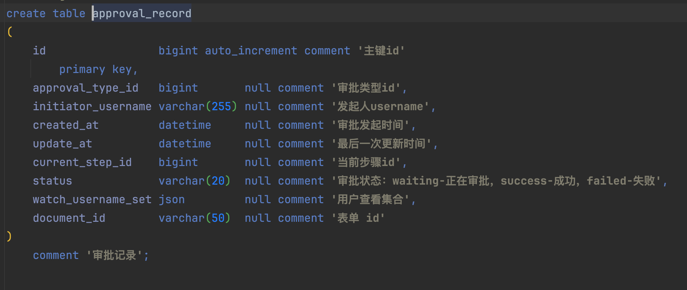
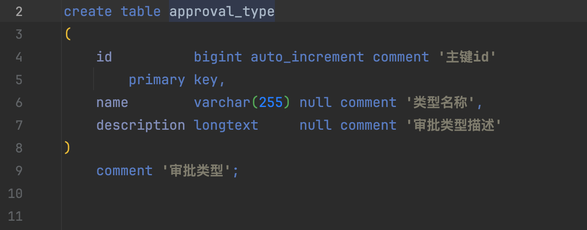
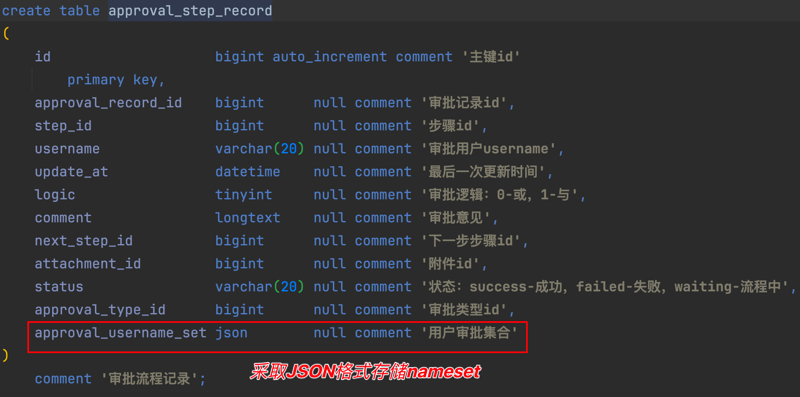

### 1. 数据库PO表设计

#### 1. ApprovalRecordPO（审批记录）

-20240607135315709.(null))

-   `id`：自增的主键 ID。
-   `approvalTypeId`：审批类型的 ID。
-   `initiatorUsername`：发起人的用户名。
-   `createdAt`：审批发起的时间。
-   `updateAt`：记录最后更新的时间。
-   `currentStepId`：当前步骤的 ID。
-   `status`：审批的状态，包括 `waiting`（正在审批）、`success`（成功）、`failed`（失败）。
-   `documentId`：关联的审核表单 ID，存储在 MongoDB 中。
-   `watchUsernameSet`：可以查看此记录的用户名集合，使用自定义的 `StringSetTypeHandler` 类型处理器。

#### 2. ApprovalStepPO（审批步骤）

-20240607135315971.(null))

该类描述了审批流程中的具体步骤。每个字段的含义如下：

-   `id`：主键 ID。
-   `stepOrder`：步骤的顺序。
-   `logic`：审批逻辑，`0` 表示与逻辑（AND），`1` 表示或逻辑（OR）。
-   `description`：步骤的描述。
-   `approvalTypeId`：关联的审批类型 ID。

#### 3. ApprovalTypePO（审批类型）

)

该类描述了审批的类型，用于分类不同的审批流程。每个字段的含义如下：

-   `id`：主键 ID。
-   `name`：类型的名称。
-   `description`：审批类型的描述。

#### 4. ApprovalStepRecordPO（审批步骤记录）

该类记录了审批流程中各步骤的执行情况。每个字段的含义如下：

-   `id`：自增的主键 ID。
-   `approvalId`：关联的审批 ID。
-   `stepId`：当前步骤的 ID。
-   `username`：审批用户的用户名。
-   `updateAt`：记录最后一次更新的时间。
-   `logic`：审批逻辑，`0` 表示或逻辑（OR），`1` 表示与逻辑（AND）。
-   `comment`：审批意见。
-   `nextStepId`：下一步的步骤 ID。
-   `attachmentId`：关联的附件 ID。
-   `status`：审批的状态，包括 `success`（成功）、`failed`（失败）、`waiting`（流程中）、`transfer`（流转）。
-   `approvalTypeId`：关联的审批类型 ID。
-   `approvalUsernameSet`：参与审批的用户集合，使用自定义的 `StringSetTypeHandler` 类型处理器。

