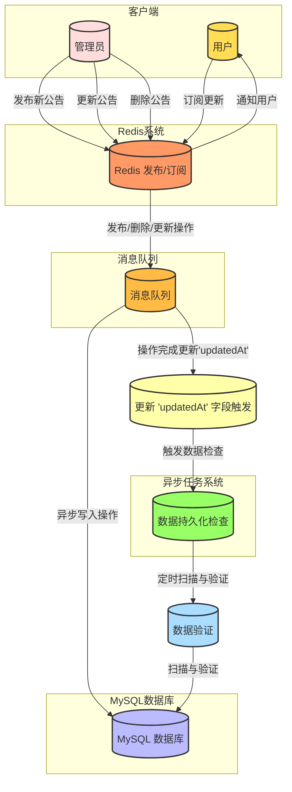

https://chatgpt.com/c/b47f7b9a-6051-489b-a88a-7f73eba39b9a

**高效公告管理与数据一致性保障系统**  
使用Redis的发布订阅模式快速处理公告通知，结合消息队列与MySQL确保数据的异步持久化和精准验证。

为了撰写关于高效公告管理与数据一致性保障系统的两部分博文，这里是一个详细的博文大纲，分别对应上下集内容：

### 上集：高效公告管理系统设计
1. **引言**
   - 简述系统的设计目的和核心价值：实时公告发布与快速响应。

2. **架构概览**
   - 描述整个系统的基本架构，包括Redis、消息队列和MySQL的角色。
   - 介绍各组件的选择理由和它们在系统中的作用。

3. **Redis的发布订阅模式详解**
   - 详细说明Redis发布订阅模式的工作原理。
   - 讨论如何使用Redis来处理公告的发布、修改和删除操作。
   - 展示如何通过Redis实现消息的即时广播。

4. **管理员与用户交互**
   - 说明管理员如何发布和管理公告。
   - 描述用户如何接收和响应公告。

5. **案例研究**
   - 提供一个具体的使用场景，展示Redis在实时消息处理中的效率和效果。

### 下集：数据一致性与持久化保障

1. **引言**
   - 回顾上集内容，桥接到数据一致性的重要性。
   - 简述数据一致性在公告系统中的作用。

2. **消息队列的作用与配置**
   - 详解消息队列如何连接Redis与MySQL，保障数据传输的安全与可靠。
   - 讨论消息队列在处理高并发情况下的性能优势。

3. **MySQL数据持久化策略**
   - 描述MySQL在系统中的数据持久化角色。
   - 讨论如何通过异步任务保证数据的一致性和完整性。

4. **数据一致性检查机制**
   - 详述系统是如何通过定时任务进行数据一致性检查。
   - 探讨如何处理数据不一致问题，包括自动修复和异常报告。

5. **总结与展望**
   - 总结系统设计的优点和潜在的改进方向。
   - 展望未来可能的扩展和技术进步。

通过这样的结构，上集更侧重于系统的设计和用户交互，而下集深入探讨技术细节，特别是数据的一致性和持久化问题，使读者能够全面理解系统的运作机制和设计理念。

在当今信息化迅速发展的时代，企业和组织面临着持续而快速变化的信息管理需求。特别是在大型企业或活跃社区中，有效、迅速地通知和更新信息至关重要。针对这一需求，我们设计了一种高效的公告管理系统，它利用Redis的发布订阅模式来实现实时的公告发布和快速响应。这一系统的核心价值在于：

1. **实时性**：通过Redis发布订阅模式，公告信息能够在瞬间广播到所有订阅者，确保了信息的即时传递。
2. **快速响应**：系统设计考虑到用户的交互体验，通过减少等待时间和提高响应效率，使得用户可以几乎实时地获取最新公告。

这种设计不仅提高了信息传递的效率，还极大地增强了信息的覆盖能力和准确性，使得管理层和用户之间的沟通更加直接和高效。接下来的内容将详细介绍这一系统的具体架构和实现方式，展示其在现代信息管理中的应用价值和技术优势。

在我们的高效公告管理系统中，基本架构涉及三个关键组件：Redis、消息队列和MySQL。这些组件共同工作，形成了一个高性能、可靠且可扩展的系统，以支持公告的快速发布和更新，并保障数据的完整性和持久性。

### Redis的角色与作用
Redis在此系统中充当着数据处理和消息分发的核心角色。利用其高性能的发布订阅模式，Redis可以实时地将公告消息广播给所有在线的用户，确保了消息传递的即时性和高效性。Redis的这种非阻塞和基于内存的操作特性，使其成为处理大量并发连接和消息的理想选择。

### 消息队列的角色与作用
消息队列（如RabbitMQ或Kafka）扮演着信息桥梁的角色，连接Redis和MySQL数据库。当公告通过Redis发布后，相关操作（如创建、更新、删除公告）的信息会被送入消息队列。消息队列缓存这些操作，然后以可靠和有序的方式异步传递至MySQL数据库进行持久化存储。这种机制不仅缓解了直接写入数据库可能带来的性能瓶颈，也为系统提供了一种处理高峰流量的有效方法。

### MySQL的角色与作用
MySQL数据库在系统中负责数据的持久化，保证了公告信息的长期存储和数据安全。尽管Redis能够快速处理和传递消息，但作为内存数据库，其在系统重启或故障时可能面临数据丢失的风险。通过将公告数据持久保存在MySQL数据库中，我们能确保即使在系统故障后也能恢复所有的公告信息。

### 组件选择的理由
选择这三个组件的理由基于它们在各自领域内的优越性能和广泛认可的稳定性。Redis以其极高的数据读写速度和灵活的数据结构支持快速消息处理。消息队列为系统的稳定运行提供缓冲，并处理数据流的峰值压力。MySQL的广泛使用和强大的查询优化则保证了数据的安全和一致性。这种组合优化了系统的整体性能，同时保持了扩展性和可维护性。

这样的架构设计不仅满足了现代信息处理系统对速度和可靠性的双重需求，还提供了足够的灵活性来适应未来可能的扩展或技术更新。

### Redis的发布订阅模式详解

Redis的发布订阅模式是一种消息通信模式，允许发送者（发布者）将消息发送到一个通道，而接收者（订阅者）则监听这些通道来接收消息。这种模式在处理高吞吐量的实时消息系统中非常有效，尤其适用于需要快速通知大量用户的应用场景。

#### 工作原理
Redis的发布订阅系统基于“发布者-订阅者”模式，不需要知道消费者的具体信息，消息通过一个中介（通道）来传递。这里的通道可以视为消息队列，但与传统消息队列不同的是，Redis中的消息一旦投递即被消费，不会进行存储：

1. **发布（PUBLISH）操作**：发布者发送消息到一个指定的通道，这个操作是非阻塞的，发布者无需等待任何订阅者的响应。
2. **订阅（SUBSCRIBE）操作**：订阅者通过订阅一个或多个通道来接收消息。一旦订阅了通道，每当有消息发送到通道时，Redis就会将消息推送给所有当前订阅该通道的订阅者。
3. **模式订阅（PSUBSCRIBE）**：订阅者可以订阅符合特定模式的通道，这样任何匹配该模式的通道有消息时，订阅者都会收到通知。

#### 处理公告的发布、修改和删除操作
在公告系统中，使用Redis的发布订阅模式可以高效地处理公告的发布、修改和删除操作：

- **发布公告**：当一个新公告创建时，系统将公告内容发布到一个预定义的通道，比如`announcement`。所有订阅了这个通道的客户端（比如用户的浏览器或移动应用）会实时收到这条公告。
  
- **修改公告**：修改操作同样通过向`announcement`通道发布一条带有修改标识和新内容的消息来实现。订阅者接收到这条消息后，可以更新他们端上显示的公告内容。
  
- **删除公告**：删除公告时，系统向通道发送一条包含公告ID和删除指令的消息。订阅者在接收到这条消息后，将对应的公告从他们的界面中移除。

#### 实现消息的即时广播
Redis的发布订阅模式能够实现消息的即时广播，这一点对于需要快速响应的系统尤为重要。通过将消息即时发送到所有在线的订阅者，Redis确保信息能够迅速且广泛地传播。这种方式的优势在于：

- **低延迟**：Redis在内存中操作，因此能够提供极低的延迟性能。
- **高吞吐量**：Redis能够处理每秒数十万条消息，适用于高并发的环境。
- **简化的应用逻辑**：由于发布订阅模式的解耦特性，应用的各个部分可以独立地进行开发和扩展，提高了系统的可维护性和扩展性。

通过以上详细分析，我们可以看到Redis的发布订阅模式不仅提供了一种高效的消息传递机制，还极大地简化了实时消息系统的实现。这种机制在我们的公告管理系统中发挥着核心作用，使系统能够高效地处理和广播大量的公告操作。

### 管理员与用户交互

在高效公告管理与数据一致性保障系统中，管理员和用户的交互是通过一套精心设计的流程来实现的。以下详细描述了管理员如何发布和管理公告，以及用户如何接收和响应这些公告。

#### 管理员发布和管理公告

1. **发布公告**：
   - **操作界面**：管理员通过一个专门设计的管理界面来发布公告。这个界面通常包括文本编辑器和一些选项，如公告的有效期、目标用户群等。
   - **发布过程**：填写公告内容和相关配置后，管理员点击“发布”按钮。系统后端将这条公告信息发送到Redis的发布订阅系统。
   - **即时反馈**：一旦公告发布，所有在线的用户都将通过订阅的通道即时收到这条公告。

2. **修改公告**：
   - **更新操作**：如果需要修改已发布的公告，管理员可以在同一管理界面中选择对应的公告进行编辑。修改完成后，重新发布。
   - **实时更新**：修改的公告同样通过Redis广播给所有订阅者。系统设计确保新的修改能够覆盖或更新原有的内容，无缝地通知到用户。

3. **删除公告**：
   - **删除流程**：管理员可选择需要删除的公告，并通过管理界面发起删除操作。一键删除后，后端处理这一指令并通过Redis通道发送删除通知。
   - **移除通知**：用户端接收到删除操作的通知后，对应的公告将自动从用户界面中移除。

#### 用户接收和响应公告

1. **接收公告**：
   - **订阅机制**：用户设备或客户端应用在登录或启动时自动订阅公告通道，确保能接收到最新的公告消息。
   - **即时显示**：当Redis发布新的公告或更新时，所有订阅了该通道的用户将立即在其设备上收到通知，并显示最新的公告内容。

2. **响应公告**：
   - **交互功能**：用户可以通过点击公告中的链接或按钮来进行响应，例如参加某个活动或填写调查问卷。
   - **反馈机制**：用户的操作和反馈可以通过客户端应用回传到服务器，进行数据收集和进一步的分析。

通过这种设计，管理员能够高效地发布和管理公告，而用户则可以实时地接收和响应公告。整个系统的设计旨在确保信息的快速传播和高度互动，从而提升整个组织的沟通效率和用户参与度。

### 小结

在上半部分的讨论中，我们详细介绍了高效公告管理与数据一致性保障系统的关键组件和功能。系统利用Redis的发布订阅模式实现了公告的快速传播，结合消息队列和MySQL数据库保障了数据的异步持久化和一致性。我们探讨了如下关键点：

1. **系统架构**：我们详述了系统中Redis、消息队列和MySQL的角色及其相互作用，展示了这种架构如何优化公告传播的速度和可靠性。
   
2. **Redis的发布订阅模式**：对Redis的发布订阅模式进行了深入分析，说明了其在实现即时消息广播中的核心作用及优势，特别是在处理大量并发消息时的高效性。

3. **管理员与用户交互**：详细讨论了管理员如何通过系统界面发布、修改和删除公告，以及用户如何实时接收和响应这些公告。这种交互机制不仅确保了信息的及时更新，还提高了用户的参与度和满意度。

通过这一部分的讨论，我们可以看到，该系统通过技术的合理应用，有效地解决了公告管理中的实时性和数据一致性问题，提供了一个既快速又可靠的解决方案。接下来的内容将进一步探讨消息队列在系统中的具体应用，以及如何通过定时任务和数据验证确保MySQL数据库中数据的完整性和准确性。
