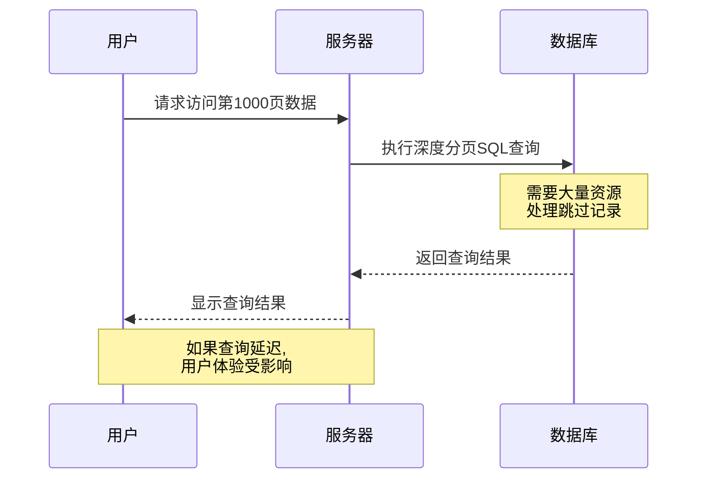
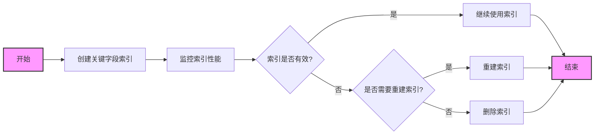
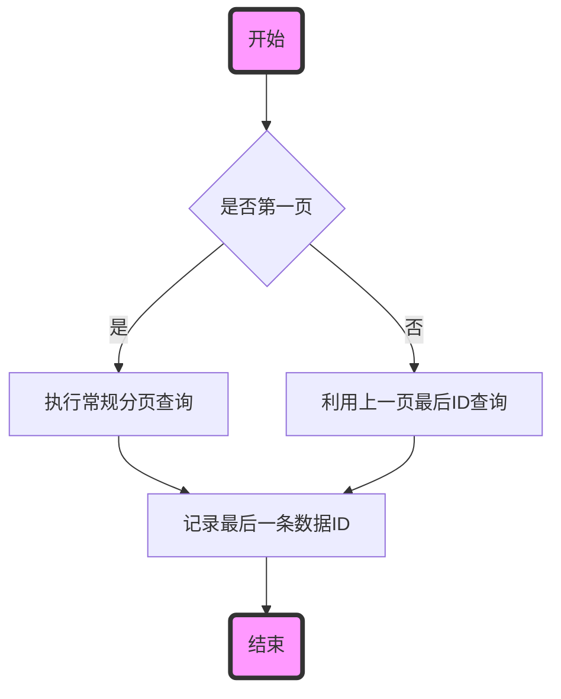

# 深度分页优化到双写异步同步：构筑高性能大规模数据查询架构

## 0. 文章前言

### 初衷

本章节旨在解决大型在线教育平台面临的一个常见但棘手的技术挑战——深度分页问题，以及如何有效地通过使用Canal和消息队列异步同步MySQL数据到Elasticsearch。笔者目的是提供一套实用的解决方案，以帮助开发者和架构师优化数据查询性能，减少系统的响应时间，从而提升用户的体验和满意度。

### 适合人群

这篇文章主要面向有一定技术背景的软件开发者、以及对高性能系统设计感兴趣的技术领导者。如果您正在寻找高效处理大数据集的方法，或者需要实现复杂的数据同步需求，本文将提供您需要的深入分析和具体操作指南。对于初学者，本文也有助于构建对数据处理技术的基本理解。

### 内容结构

本章将从深度分页问题的定义和影响开始，逐步探讨分库分表、索引优化策略以及使用全局唯一标识符等数据库优化技术。随后，我们将深入讨论如何通过Canal和消息队列实现MySQL到Elasticsearch的异步数据同步。每部分都将结合具体案例，详细说明实施步骤和预期效果，确保读者能够理解并应用这些高级技术来解决实际问题。

### 温馨提示

本文内容涉及较多高级技术和具体实现细节，建议读者在阅读时结合实际项目和已有技术基础进行理解。文章中的解决方案和技术建议基于当前的技术环境，未来可能因技术进步而发生变化。此外，请注意，每种技术和策略的选型都应基于具体的业务场景和需求来决定，盲目应用可能不会达到预期效果。希望本文能够为您提供帮助，并欢迎任何形式的建议和反馈。


# （三）**深度分页：索引+主从分离提升数据库性能**

## 1. 引言

在当今的大型在线教育平台中，数据处理不仅是维护日常运营的基础，更是优化用户体验和提高平台效率的关键。随着用户数量的增加和业务范围的扩展，这些平台每天都会生成和处理数以百万计的数据点，例如学生成绩，对每个学生老师的公告信息，课程聊天记录，评论区留言。尤其是在处理如学生成绩这类关键数据时，数据量的庞大带来了显著的挑战。

#### 1.1 什么是深度分页

深度分页是在处理大数据集查询时，用户尝试访问多页数据中较后面的页面时遇到的一个问题。

例如，一个在线教育平台上存储了数百万条学生成绩记录，当教师或学生试图查看排序后的成绩列表的第1000页或更后面的页面时，数据库需要先跳过前面数十万条记录，才能到达目标页面。这一过程通常涉及大量的数据扫描和排序，极大地增加了数据库的查询负载，从而成为性能瓶颈。

在技术层面上，深度分页问题主要由于数据库在处理分页请求时必须执行高成本的行跳过操作（row skip），导致处理时间随页数的增加而大幅增长。


### 1.2 深度分页问题的具体场景

考虑到一个典型的场景，一个拥有数百万用户的在线教育平台在期末需要生成和查询学生成绩。在这种情况下，学生成绩数据可能接近200万条记录。如果教师、学生或家长需要检索特定成绩记录，系统通常需要执行分页查询来管理这些大量的数据。然而，当这些查询要求加载非常深的页面——比如说，用户试图访问第10000页的内容——每次查询可能需要处理高达200万条数据，导致检索时间过长。这种深度分页导致的查询时间过长不仅消耗服务器资源，还严重影响了系统的响应速度和用户的满意度。

譬如，笔者在线上环境排查问题时，每次分页查询学生的成绩时，经常遇到查询过程耗时过长的问题。特别是在首次加载时，**前端页面可能会显示一个持续转动的加载图标，而页面无法成功加载**，导致用户界面长时间无响应。这种情况下，用户通常会认为网络问题，因为无法忍受长时间的等待，而选择刷新页面，希望能够加速加载过程。

但是等待一段时间之后，用户再次点击查询的时候，会发现学生成绩马上就加载出来了。**这个问题的原因在于，虽然第一次查询时，系统并没有能够快速地将查询结果返回并在前端页面渲染，但后台线程已经开始异步地将数据库查询结果缓存到Redis中。**这一缓存操作虽然有助于减少后续查询的时间，使得用户在稍后再次尝试查询时能够几乎立即看到结果，但首次查询的延迟仍然严重影响了用户体验。

在大数据环境下，传统的分页查询方法（如SQL的OFFSET和LIMIT子句）变得不再适用。因为这些方法需要数据库扫描大量的跳过记录，直到达到所需的分页位置，这在数据量巨大时效率极低。例如，查看下面的这条语句 ：

```sql
SET profiling = 1;
SELECT * FROM score_information
ORDER BY id
LIMIT 999900, 10;
SHOW PROFILES;
```

该查询要求数据库跳过前999900条记录，这在后台需要进行大量的数据处理和排序，对数据库性能造成极大压力。


使用MySQL的`profiling`功能，我们可以精确地测量并分析每个查询的执行细节，从而识别和解决性能瓶颈。

#### 启用查询性能分析

首先，通过设置`profiling`为1，我们启用了对所有执行的查询的性能监控：

```sql
SET profiling = 1;
```

接着执行我们关注的深度分页查询：

```sql
SELECT * FROM score_information ORDER BY id LIMIT 999900, 10;
```

#### 查看性能分析结果

通过`SHOW PROFILES;`，我们获得了最近执行的一系列查询的性能数据，这包括了每个查询的查询ID、执行时间（Duration）和查询本身（Query）。

```plaintext
Query_ID  Duration   Query
-------  --------   -----
247      0.0001815  SHOW WARNINGS
...      ...        ...
255      1.30420325 SELECT * FROM score_information ORDER BY id LIMIT 9999000, 10
...      ...        ...
```

从输出中可以看到，Query_ID为255的查询，即我们的深度分页查询，执行时间达到了1.304秒。这个时间相比其他系统操作（如设置事务隔离级别、读取数据库配置等）明显较长。

#### 分析和解释性能数据

- **执行时间（Duration）**：最关键的度量指标之一。对于ID为255的查询，执行时间为1.304秒，远高于其他操作，如`SELECT @@session.transaction_isolation`的0.000256秒。这反映了深度分页查询的性能开销极大，尤其是当数据库需要跳过数百万条记录以达到指定的分页位置时。
- **查询（Query）**：提供了执行的具体SQL语句，让我们能够精确地知道哪些查询影响了性能。


### 1.2 系统响应性的影响

系统响应时间的延长直接影响到用户体验。在教育行业，尤其是在线学习平台，响应时间是衡量用户满意度和教育效果的重要指标之一。学生和教师期望能够迅速访问和分析成绩数据，以便及时调整学习计划或教学方法。因此，优化查询性能，尤其是解决深度分页问题，成为提升整个系统性能的关键任务。

在接下来的章节中，笔者将探讨深度分页的原因，以及几种解决深度分页问题的策略，包括数据库优化、查询改进。我们将通过具体的案例和技术实施指南，详细展示如何在大规模数据环境下实现高效的数据查询和处理。


## 2. 深度分页的问题分析

### 2.1 深入理解深度分页及其在数据库中的影响

#### 深度分页的成因和影响

深度分页主要发生在数据库需要处理请求时跳过大量数据行以到达特定页面的情形。

**使用`LIMIT m, n`语法在一个大型数据库表中查询数据时，系统需要首先获取前`m+n`条记录，然后丢弃前`m`条，最后返回后`n`条。**这种操作对于前几页数据可能还不显著，但随着`m`的增大（即用户访问越来越靠后的页面），所需处理的数据量显著增加，导致查询效率急剧下降。




#### 聚簇索引与深度分页

在大多数数据库系统中，如MySQL的InnoDB存储引擎，使用聚簇索引（Clustered Index）来存储表中的数据。聚簇索引并不是独立的结构，而是表数据页本身，表中的数据按照此索引的键值存放。

这意味着，如果主键作为聚簇索引，每次查询实际上都是在聚簇索引上进行的。

对于深度分页，当页面位置非常靠后时，数据库需要在聚簇索引上逐条跳过大量数据，直到达到所需的行。这一过程非常耗时，尤其是当表中的数据行数极大时。


#### 二级索引（非聚簇索引）和回表操作

二级索引，或称为非聚簇索引，在MySQL中存储的是索引字段的值及对应行的主键值，而非直接的行数据。

也就是说，二级索引存储的是索引键和对应聚簇索引键（主键）的映射。**当查询利用二级索引时，数据库首先在二级索引中找到满足条件的所有主键值，然后再通过这些主键值在聚簇索引中查找实际的行数据。**这个过程称为回表。

在深度分页场景下，如果使用二级索引进行查询，数据库可能会首先从二级索引获取大量的聚簇索引键，然后在聚簇索引上进行大量的回表操作以获取实际数据。

例如，如果通过二级索引找到了前`m+n`个主键值，接下来还需要在聚簇索引中根据这些主键值检索具体的数据。这里涉及一次回表+一次舍弃数值。

这一过程在`m`值很大时尤其耗时，因为每次回表都可能涉及一次磁盘I/O操作，特别是当所需的数据不在内存中时。


#### 减少回表操作的策略

**使用覆盖索引**：设计索引以包括查询中需要的所有列。这样，查询可以直接从索引中获取所需数据，而无需回表到聚簇索引。覆盖索引能显著减少对聚簇索引的访问，提高查询效率。创建索引可以使得数据库管理系统（DBMS）不必扫描整个表就能快速定位到所需的数据行。这是因为索引提供了快速查找路径，类似于书籍的目录，DBMS可以通过索引直接访问数据页。

笔者已经对常用需要返回的数据集合建立了**索引**：

```sql
create index idx_grade_course
    on score_information (grade, course_code);

create index idx_student_id
    on score_information (student_id);
```

#### 索引性能评估

随着数据量的增加和查询模式的变化，原有的索引可能不再适合当前的需求。因此，定期评估索引的性能是必要的。这包括监控索引的使用情况，检查是否有未被利用的索引，或者某些索引是否因为数据增长导致效率下降。

索引的评估可以通过查询数据库的系统表来实现，许多数据库管理系统提供了可以查看索引性能和使用情况的工具。例如，可以使用如下SQL查询来检查索引的使用频率：

```sql
SELECT * FROM sys.dm_db_index_usage_stats WHERE object_id = OBJECT_ID('student_scores');
```

此查询在SQL Server中使用，它返回了`student_scores`表索引的使用统计信息，帮助数据库管理员决定是否需要对索引进行调整。

如果发现某个索引很少被查询使用，或者索引维护的成本（如更新索引所需时间）超过了它带来的性能提升，那么可能需要考虑删除或重新设计这个索引。




优化策略如下——

## 3. 数据库分库分表 或者 主从分离

**分库分表**和**主从分离**是两种常见的数据库架构优化策略，尤其在处理大数据量查询和检索时表现出显著优势。

#### 分库分表的优势

**分库分表**的主要优势在于将数据分散到多个数据库或表中，减轻单一数据库或表的负担，从而提高查询和写入性能。具体而言：

1. **提高性能**：通过分库分表，我们可以分散数据，减小每个数据库或表的规模，从而提高查询和写入的速度。在大数据量的查询场景下，分库分表可以显著减少查询的时间和资源消耗。
2. **水平分表：增强系统可扩展性**：分库分表可以根据数据量的增长，灵活扩展数据库或表的数量，从而支持系统的可扩展性。在大数据量查询和检索的场景中，这一点尤为重要。
3. **垂直分表：优化资源利用**：分库分表可以将不同业务场景的数据分散到不同的数据库或表中，使得资源利用更加高效。对于不同性质的数据，可以采取不同的存储策略，从而提高查询和写入的效率。

#### 主从分离的优势

**主从分离**的主要优势在于将读写操作分开，减轻主库的负担，提高查询性能。具体来说：

1. **提高查询性能**：在主从分离的架构中，读取操作可以从从库中获取，而写入操作则由主库处理。这种分离使得主库不再承担读取负载，从而提高了查询性能。在大数据量查询和检索的情况下，这种分离能够显著减轻主库的压力。

2. **增强系统扩展性**：通过增加从库的数量，主从分离可以有效提高系统的读取能力。在大数据量查询场景中，我们可以通过添加更多的从库来处理高并发的查询请求。

3. **提高数据可用性**：主从分离提高了数据的冗余度和可用性。即使某个从库不可用，我们仍然可以从其他从库中获取数据。这种多副本的架构在处理大规模数据查询时尤为重要，可以有效提高系统的稳定性和可靠性。

4. ==**分担查询压力**：深度分页会对数据库产生较大的压力。通过主从分离，我们可以将分页查询放在从库中进行，从而分担数据库的压力，提高查询的响应速度。==

考虑到当前数据库的数据条数规模约在数百万条数据左右，距离达到一千万条还有距离。主要问题是，客户端对数据库的请求量相对较大，因此笔者暂时不考虑引入分库分表策略。相反，我们决定先采用主从分离的策略，以提高查询效率。

在规模相对较小的情况下，主从分离可以有效分担读写操作，将读操作从主库中分离出来，放到从库中进行处理。这样不仅可以减轻主库的压力，还能够提高系统的查询性能和响应速度。采用主从分离策略也为未来的扩展留下了灵活的空间，在业务需求增长和数据规模扩大后，仍可以继续优化架构。

笔者的主从逻辑如下，采取一主一从的策略，最主要的就是查看`rule`部分的属性配置。这部分配置实现了主从数据库之间的读写分离。它通过静态配置定义了数据源，并指定了自动感知和写数据源的名称为`master`。读数据源包括`master`和`slave`，实现了**读写分离**。配置中的负载均衡策略采用了轮询方式，以确保读请求在主从数据库之间均匀分布。

```yml
shardingsphere:
    # 属性配置
    props:
      # 显示修改以后的sql语句
      sql-show: false  # 是否打印sql
      sql-simple: false  # 打印简单的sql

    datasource:
      names: master,slave

      master:
        type: com.zaxxer.hikari.HikariDataSource
        driver-class-name: com.mysql.cj.jdbc.Driver
        jdbc-url: X
        username: X
        password: X
        hikari:
          maximum-pool-size: 2000  # 设置最大连接数为1000
          leakDetectionThreshold: 60000  # set to 60 seconds for example
          idleTimeout: 300000  # set to 5 minutes for example

      slave:
        type: com.zaxxer.hikari.HikariDataSource
        driver-class-name: com.mysql.cj.jdbc.Driver
        jdbc-url: X
        username: X
        password: X
        hikari:
          maximum-pool-size: 2000  # 设置最大连接数为1000
          leakDetectionThreshold: 60000  # set to 60 seconds for example
          idleTimeout: 300000  # set to 5 minutes for example

    rules:
      readwrite-splitting:
        data-sources:
          mds:  # 名字自定义
            type: static  # 类型 静态获取
            props:
              auto-aware-data-source-name: master
              write-data-source-name: master
              read-data-source-names: master, slave  # 添加这两个才能平等读 否则只有 slave 在读
            load-balancer-name: read-random  # 读写分离规则自定义命名

        load-balancers:
          read-random:
            type: ROUND_ROBIN  # 轮询负载均衡
```

>   -   **`sql-show`**：布尔值，控制是否显示修改后的SQL语句。将其设置为`false`可以关闭SQL打印，以减少日志输出，增强系统的性能。
>   -   **`sql-simple`**：布尔值，控制是否打印简化后的SQL语句。`false`意味着不打印简单的SQL。

在规则配置部分，配置了读写分离（`readwrite-splitting`）的相关属性：

-   **`data-sources`**：定义了数据源配置。
    -   **`type`**：这里设置为`static`，表示静态配置。
    -   `props`：配置了读写分离的相关属性。
        -   **`auto-aware-data-source-name`**：设置了自动感知的主数据源名称，这里为`master`。
        -   **`write-data-source-name`**：设置了写数据源名称，这里也为`master`。
        -   **`read-data-source-names`**：指定了读数据源的名称。为了实现主从读写分离，通常包含主数据库和从数据库，在这里为`master`和`slave`。
    -   **`load-balancer-name`**：设置了读写分离的负载均衡名称，这里为`read-random`。
-   **`load-balancers`**：定义了负载均衡策略。
    -   **`type`**：指定了负载均衡的策略。在这里使用了`ROUND_ROBIN`，这是轮询负载均衡策略。


## 4. 深度分页的特定解决方案

#### 子查询优化

子查询优化技术可以显著减少主查询需要处理的数据量。==具体实现时，子查询用于精确定位数据范围，主查询则专注于这部分数据的处理。==

这样，主查询只需要处理特定的数据子集，避免了对整个数据集的无效扫描。**例如，在一个学生成绩系统中，我们可能需要查看数学成绩在80到90分之间的学生详细信息。**通过子查询，我们可以先找到符合条件的学生ID，然后再基于这些ID来获取学生的详细信息。

**示例SQL**:

```sql
-- 假设需要查询数学成绩在80到90之间的学生详细信息
SELECT s.student_id, s.name, s.class
FROM students s
WHERE s.student_id IN (
    SELECT g.student_id
    FROM grades g
    WHERE g.subject = 'Mathematics' AND g.score BETWEEN 80 AND 90
);
```

在这个例子中，子查询首先在`grades`表中找出成绩在80到90分的学生ID，然后主查询根据这些ID从`students`表中提取详细信息。这种方法有效减少了需要处理的记录数量，尤其是当`grades`表数据量极大时。


#### 索引跳跃

索引跳跃方法利用数据库索引，以减少每次查询需要处理的数据量，特别是在分页查询中。通过记住上一页的最后一个或第一个索引值，下一页的查询可以直接从该点开始，避免重新扫描大量不必要的数据。

**示例SQL**:

```sql
-- 假设已知上一页最后一条记录的student_id为1023，现在查询下一页数据
SELECT *
FROM students
WHERE student_id > 1023
ORDER BY student_id
LIMIT 10;
```

这个查询利用上一页的最后一个`student_id`作为起点，从而实现快速定位并减少服务器的工作负担。



## 5. 解决方案探讨

为了应对深度分页问题并优化大规模数据处理系统的性能，我们可以采用多种策略，包括使用Elasticsearch优化数据索引，利用游标或滚动API改进数据访问方式，以及通过缓存机制减轻数据库的查询负担。

#### 避免深度分页

深度分页问题主要是由于传统的分页查询（使用OFFSET和LIMIT）在面对大量数据时效率极低。这里有两种主流的解决方案：

1. **使用Elasticsearch进行数据索引**:
    Elasticsearch 是一个基于Lucene构建的开源搜索引擎，它支持高效的全文搜索和复杂查询操作，并且具备高度的可扩展性。通过将数据索引到Elasticsearch，我们可以利用它的强大搜索能力来快速检索需要的记录，从而避免在数据库上执行耗时的深度分页查询。

    在实际应用中，可以将常用的查询数据如学生成绩、用户行为记录等事先索引在Elasticsearch中，当需要进行分页查询时，直接在Elasticsearch中执行，利用其快速响应的特性来提供更好的用户体验。

2. **引入游标（cursor）或滚动（scroll）API**:
    游标和滚动查询是许多数据库和搜索引擎支持的功能，允许应用程序持续访问查询结果，而不是一次性加载所有数据。这样的方法避免了大量数据一次性加载造成的延迟和内存压力。

    例如，在Elasticsearch中，可以使用滚动API进行大批量数据的处理，这不仅减少了内存的使用，也保持了查询的连贯性。滚动查询通过保持查询上下文来帮助检索大量数据，适用于需要处理或导出大数据集的场景。

这些将在我们后续的文章中提到。

## 6. 结语

在这一章节中，我们已经探讨了多种技术手段以解决深度分页问题，在后续的博文中，我们将继续探讨如何通过数据同步和一致性问题的高级解决方案来进一步提升系统性能和可靠性。我们将深入讨论如何通过实时数据同步技术如Canal和MQ，以及如何设计数据一致性保证机制，来确保系统在处理大规模数据时的高效和准确。

这些讨论将为读者提供更全面的知识和工具，以应对未来数据量增长和业务扩展带来的挑战。敬请期待更多关于构建高性能架构的深入分析和实用建议。

