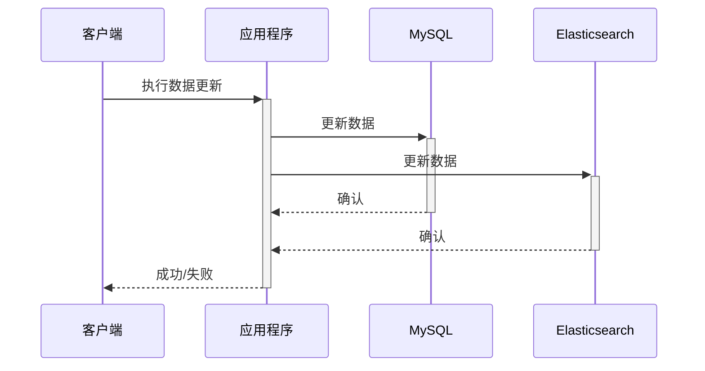
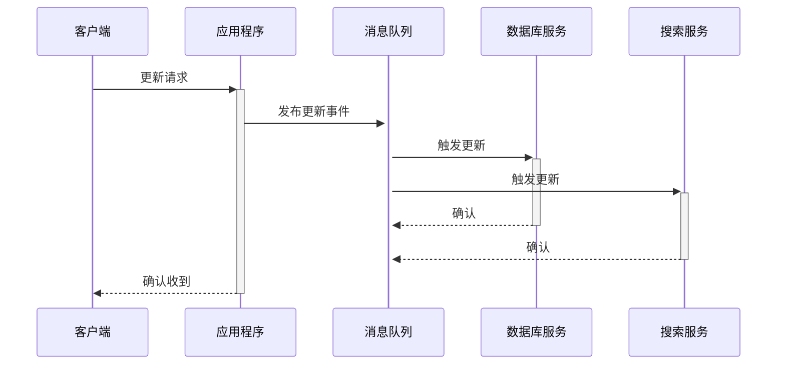

# （四）**双写一致性：ES与MySQL数据同步的直接同步与异步解决方案**

### **1. 引言**

在我们上一篇讨论中，我们探讨了如何解决深度分页问题，尤其是在大规模数据集合中进行高效查询的挑战。然而，尽管对MySQL进行了优化，这些改进仍然无法完全满足我们对海量数据查询的需求，特别是在面对如学生成绩检索，或者文档中关键字搜索等复杂查询（未来需求）时。这促使我们考虑引入Elasticsearch（ES）。

Elasticsearch能够提供高性能的搜索功能，它能快速处理大量数据，并支持复杂的查询操作，这对于改善用户体验和响应时间是至关重要的。然而，引入ES后，我们面临了一个新的挑战：数据一致性。众所周知，学生成绩查询是教育系统中常见的功能，它不仅需要高效率，还需要极高的数据准确性。教师、学生及其家长可能会定期访问系统以查看最新的成绩信息。

在学期中，成绩可能会频繁更新，如作业成绩、期中考试和期末考试等。每次成绩更新后，都需要在MySQL和ES之间进行快速且一致的数据同步。当成绩刚刚录入系统后，学生和家长通常希望能立即在线查看这些成绩。如果ES中的数据同步延迟或不一致，用户可能无法看到最新的成绩数据，导致混淆和不满。此外，不仅仅是学生和家长会关注，教师和行政人员也需要访问这些数据以进行教学准备和学术评估。

本节中，我们将深入探讨为何我们需要关注MySQL与ES之间的双写一致性，并分析实现这一目标的不同同步策略。笔者将比较直接同步和异步解决方案的优势及其适用场景，为您在设计系统时考虑数据同步策略提供实用的视角。这不仅关乎技术实现，更是对业务流畅运作的保障。


### 2. **直接同步双写**

**定义和工作原理**

直接同步双写是一种数据同步策略，通常用于确保两个或多个数据存储（如数据库和搜索引擎）之间的数据一致性。在这种模式下，每个写操作（如插入、更新或删除）同时在所有相关的数据存储上执行。这种方式确保了操作的原子性，即要么所有数据存储同时更新，要么操作失败回滚。



在此图中，客户端请求更新数据，应用程序同时向MySQL和Elasticsearch发送更新请求。只有当所有系统都成功更新并返回确认时，应用程序才会向客户端报告操作成功。直接同步双写能够在操作时就确保数据的一致性，避免了数据不一致带来的风险。

看上去已经解决了问题，但是或许并不如我们想象的那么简单。

那么，缺点有什么呢？

读者可以自行查看这部分的一个Demo级别的代码——

```java
import org.springframework.stereotype.Service;
import org.springframework.transaction.annotation.Transactional;

@Service
public class DataSyncService {

    private final JdbcTemplate jdbcTemplate;
    private final ElasticsearchRestTemplate elasticsearchTemplate;

    public DataSyncService(JdbcTemplate jdbcTemplate, ElasticsearchRestTemplate elasticsearchTemplate) {
        this.jdbcTemplate = jdbcTemplate;
        this.elasticsearchTemplate = elasticsearchTemplate;
    }

    @Transactional
    public void updateUserData(User user) {
        try {
            // 更新MySQL数据库
            jdbcTemplate.update("UPDATE users SET name = ?, email = ? WHERE id = ?",
                    user.getName(), user.getEmail(), user.getId());

            // 更新Elasticsearch
            elasticsearchTemplate.save(user);

            // 确保两个操作都成功，否则回滚
        } catch (Exception e) {
            // 如果任何一个操作失败，事务自动回滚
            throw new RuntimeException("Failed to update user data synchronously", e);
        }
    }
}

```


显然**代码耦合度非常高**，数据库更新操作和ES的更新操作同时放在同一个函数方法中，后续改动代码逻辑需要对整一块代码进行重新维护修改，显著增加维护难度。任何对数据库或搜索引擎配置的更改都可能需要重新审查和修改这部分代码。

更重要的一个问题，可能被很多读者在日常开发的过程中忽视。==**`@Transactional` 注解的事务管理仅限于数据库事务的范围，它不支持跨多种数据存储系统的事务，尤其是那些不支持事务性操作的系统，如 Elasticsearch。**== Elasticsearch 本身不支持传统意义上的事务操作，因为它是基于 Lucene 构建的，主要面向全文搜索和高性能索引的需求，而不是事务性数据处理。

那个@Transactional注解看似维护了MySQL和ES的数据更新操作，然而事务标记(`@Transactional`)仅适用于关系数据库的更新，不涵盖对Elasticsearch的操作。设想，如果MySQL更新成功但是ES更新失败，由于没设置失败补偿机制，这部分在MySQL新增加的数据更改，将永远无法被同步到ES中。

为了解决上述不一致问题，可能需要引入额外的复杂机制，如额外的数据检查、补偿事务（compensating transactions）或使用分布式事务解决方案，这些都会增加系统的复杂性和开发难度。这种看似简单的操作，反而并没有想象中的那么简单。

此外，根据“木桶理论”，整个方法在调用的时候，需要等待所有数据存储完成更新才能返回，倘若ES的连接不健康，**接口的整体性能将被拖累**。

当然如果业务场景只局限于小规模数据处理，或者是只有少部分的方法需要这部分的同步逻辑，在数据量不大且更新频率不高的场景下（笔者内心OS：好吧还是最好别用了 555），直接同步双写的性能损失可以接受，那么可以使用这种方法。


### 3. 异步双写（消息队列）

#### **3.1 定义和工作原理**

异步双写通过消息队列实现，是一种将数据写入操作解耦的方法。在这种模式下，应用程序将数据更新事件发送到一个中间的消息队列，而不是直接更新所有数据存储。独立的消费者服务从队列中读取这些事件，并负责更新各个数据存储系统，如数据库、搜索引擎等。

最初的一个架构设计如下图：



在此图中，应用程序只负责将更新事件发送到消息队列，并立即向客户端确认收到请求。随后，数据库服务和搜索服务作为消息队列的消费者，各自设想我们这个教育平台自己的数据更新。这种模式降低了客户端操作的延迟，并且增加了系统处理高并发的能力。

极大程度上**减少系统耦合**，增加了代码的模块化，便于维护和升级。而且通过异步发送数据更新事件，无需等待所有数据存储完成更新。

缺点也有，譬如系统复杂度增加。引入消息队列增加了系统架构的复杂度，需要维护额外的组件如消息队列服务器。

一个更重要的缺点不容被忽视。我们知道，在软件架构中，使用消息队列来实现异步数据同步是一种常见的设计模式。根据软件工程中的上游和下游理论，系统可以划分为**==数据源（上游）和数据消费者（下游）==**。

当前的系统架构是，当在上游数据库（例如MySQL）中更新数据后，将发送一条消息到消息队列，以通知下游系统（例如Elasticsearch，ES）进行相应的更新。在这个框架中，有一个明显的潜在缺陷需要关注：**消息丢失的问题**。如果没有合适的补偿机制，这种架构中的ES更新只能依赖于消息队列的通知。因此，一旦消息在传递过程中丢失或者更新失败，在调用ES查询时将无法实时获取上游数据库中的数据，甚至可能导致部分数据的永久缺失。

这种架构在一定程度上减少了系统的耦合性，提升了代码的模块化程度，便于维护和升级，同时通过异步发送数据更新事件避免了等待所有数据存储完成更新的延迟。然而，系统复杂度和运维支持要求也因此增加。不过，瑕不掩瑜就是了。

但是有一个隐秘的问题不容我们忽略。

让我们再次回到我们当前的开发业务场景。当我们大批量在数据库中对学生数据进行增删改查之后，我们希望把这些学生成绩的数据马上同步到es里面。如果出现消息丢失的问题，当教务员或者是学生本人去查询个人成绩或者是班级成绩的时候，发现部分的数据将会有残缺或者是落后于某个版本。这种消息丢失的情况是不允许忍受的，这个系统架构必须做出优化。

请大家停留片刻，思考一下，我们该怎么做出优化？

笔者给出的一个解决方法如下：

**首先，我们需要确保消息的可靠传递和处理，例如通过使用事务消息或者补偿机制来保障消息传递的完整性。**

**此外，可以考虑在ES中设置数据版本控制或者采用定期数据同步的策略，以确保数据的一致性。**

**最后，加强对消息队列的监控与预警机制，及时发现和处理异常，以保持系统的高可用性和稳定性。**

本处我们只是具体讨论如何优化消息队列的有关配置。因此我们只聚焦于第一点。让我们一起来着手优化。


#### 3.2 优化策略

##### 3.2.1 将消息队列的自动确认机制改为手动确认

**首先，我们需要确保消息的可靠传递和处理，例如通过使用事务消息或补偿机制来保障消息传递的完整性。** 在Spring Boot中，可以通过配置 `SimpleRabbitListenerContainerFactory` 来设置手动确认消息。例如：

```java
@Bean
public SimpleRabbitListenerContainerFactory rabbitListenerContainerFactory() {
    SimpleRabbitListenerContainerFactory factory = new SimpleRabbitListenerContainerFactory();
    factory.setConnectionFactory(connectionFactory);
    factory.setAcknowledgeMode(AcknowledgeMode.MANUAL);
    return factory;
}
```

通过配置`factory.setAcknowledgeMode(AcknowledgeMode.MANUAL);`使得消息被手动确认。

当然，并不是说配置了这个Bean对象之后，所有的消息都将会被转变为手动确认。我们可以同时兼顾自动确认和手动确认两种模式，而且也可以同时配置两种监听者工厂。可以在消息消费者的@RabbitListener注解内部的containerFactory标识，当前使用的是哪一个监听者工厂从而处理队列。

在消息监听器中，通过手动确认消息，可以直接使用注解标志`containerFactory`，也可以直接使用手动确认消息的API来配置消息确认情况，从而可以更好地控制消息的处理：

```java
@RabbitListener(queuesToDeclare = @Queue("${spring.rabbitmq.queue8}"), containerFactory = "rabbitListenerContainerFactory")
    public void processCanal(String messageContent, Channel channel, Message msg) {
        try {
            JSONObject message = JSON.parseObject(messageContent);
            String type=message.getString("type");
            JSONObject content = message.getJSONObject("message");

            scoreElasticSearchService.syncScore(type,content);
            // 手动确认消息
            channel.basicAck(msg.getMessageProperties().getDeliveryTag(), false);
        } catch (Exception e) {
            log.error("处理canal消息时出现异常: ", e);
            try {
                // 根据需要，拒绝消息并选择是否重新入队
                channel.basicNack(msg.getMessageProperties().getDeliveryTag(), false, false);
            } catch (IOException ioException) {
                log.error("确认消息时出现异常: ", ioException);
            }
        }
    }
```

RabbitMQ 默认最多能够重试发送三次消息。也就是说，假设消息发送失败一次后，它将会被重复投递给消费者进行处理。这个重试的次数最多为三次，如果重试失败，系统会抛出异常并记录错误。然而，如果重试超过三次，消息将被系统自动丢弃。这显然不是我们希望看到的情况。 

虽然可以在配置文件中设置重试的上限次数，也可以将上限次数设置为一个非常大的数值，甚至达到无限重试的效果。但如果有许多消息堆积且无法处理，不断在消息队列中反复重试，这显然不是一个好的实践。

因此，笔者打算引入死信队列来解决这个问题。


##### 3.2.2 引入死信队列

死信队列（DLQ）是一种用于存储无法正常处理的消息的队列。引入死信队列可以解决以下问题：

###### 1. 处理无法成功消费的消息

在消息处理过程中，一些消息可能由于内容不正确或业务逻辑问题而无法被成功消费。持续重试这样的消息不仅没有实际意义，而且可能导致资源浪费和处理延迟。例如，如果消息的格式不正确或者包含错误的数据，反复尝试处理同样的问题消息只会徒劳无功。将这些无法成功消费的消息移入死信队列，可以停止无谓的重试。

###### 2. 防止消息无限循环

在某些情况下，消息可能因为逻辑问题反复被拒绝和重试，这会导致消息在系统中无限循环。例如，如果消费者无法处理某类特殊消息并将其不断重新放入队列，那么这类消息将无限循环地被消费、拒绝、再投递。这样的循环不仅影响正常消息的处理，还会浪费系统资源。死信队列提供了一种阻断这种循环的机制，将这种问题消息转移到死信队列，从而保护了主队列的健康。

###### 3. 保持系统稳定性

连续失败的消息如果不适当地处理，可能会堵塞队列中的其他消息处理。当有大量失败消息在主队列中积压时，它们不仅占用队列资源，还会延迟其他正常消息的处理。通过将连续失败的消息快速隔离到死信队列中，可以让主队列保持清晰，确保其他消息能够及时处理。死信队列的存在有助于保持系统的响应性和稳定性，防止问题消息影响整个系统的运行。

值得一提的是，引入死信队列一般不需要对生产者部分的代码进行调整。生产者的任务主要是将消息发送到目标队列，而死信队列的相关配置通常由消费者处理，只需要确保消息被发送到合适的主队列即可。死信队列主要由RabbitMQ配置和消费者来管理，用来处理那些无法正常消费的消息。

跟上笔者的思路，我们稍微小结一下架构演变的流程——

1. **初始阶段 - 不配置失败重试次数**
    - **描述**：系统刚开始时可能没有特别的配置，使用RabbitMQ的默认行为。
    - **问题**：消息处理失败后可能会丢失，没有办法追踪或处理这些失败的消息。
    - **适用场景**：适用于对数据准确性要求不高的应用，或是可以容忍偶尔数据丢失的场景。

2. **改进阶段 - 配置很多次重试**
    - **描述**：为了防止消息丢失，增加了重试次数，尝试尽可能多的次数来确保消息可以被处理。
    - **问题**：这可能导致系统资源长时间被占用，效率低下，特别是当消息因为根本性错误而无法处理时。
    - **适用场景**：关键数据处理，确保每条消息都被尽可能处理，但需注意可能带来的性能问题。

3. **成熟阶段 - 配置3次重试次数+死信队列**
    - **描述**：结合了重试机制和死信队列的优势，限制了重试次数，并将无法处理的消息转入死信队列。
    - **优点**：避免了无限重试带来的资源浪费，同时保持了对失败消息的追踪和后续处理能力。
    - **适用场景**：适用于高可靠性需求的应用，特别是在金融、电商和其他对数据准确性和完整性有高要求的场景。

| 配置选项                     | 描述                                                  | 潜在后果                                                     | 使用场景                                           |
| ---------------------------- | ----------------------------------------------------- | ------------------------------------------------------------ | -------------------------------------------------- |
| 不配置失败重试次数           | 默认情况下，消息可能会被尝试消费3次（如果未显式配置） | 消息可能在未成功处理前丢失，无法追踪处理失败的原因           | 适用于不关键的数据或可以接受偶尔丢失的场景         |
| 配置很多次重试（近似无限次） | 消息将尝试非常多次直到成功，没有设置上限              | 消息不会丢失，但可能导致服务资源耗尽和效率低下，处理速度变慢 | 适用于数据绝对不能丢失，但可能会影响系统性能的场景 |
| 配置3次重试次数+死信队列     | 消息失败后重试3次，失败则进入死信队列                 | 失败的消息被安全存储于死信队列中，便于后续处理或审计         | 适用于需要确保数据处理可追踪和修复的重要数据场景   |


现在我们一步步实现——

1. **在RabbitMQ配置类中配置死信队列**：

    - 为学生成绩消息配置主队列和死信队列，通过设置`x-dead-letter-exchange`和`x-dead-letter-routing-key`参数将消息重定向到死信队列，declareQueue()。

2. **在消费者中设置重试机制**：

    - **设置重试机制**：添加了一个`maxRetries`变量来设置最大重试次数。使用`Thread.sleep`来设置重试间隔。
    - **手动处理重试**：使用`basicNack`方法拒绝消息，并选择不重新排队（`requeue = false`），这样消息会进入死信队列。

3. **在生产者中配置相应的路由**：

    - 配置消息路由，将消息发送到主队列。

    

1. RabbitMQ配置类

```java
@Configuration
@Slf4j
public class RabbitMQConfig {
    private final AmqpAdmin amqpAdmin;

    @Value("${spring.rabbitmq.queue1}")
    private String queue1;

    @Value("${spring.rabbitmq.queue2}")
    private String queue2;

    @Value("${spring.rabbitmq.dead-letter-exchange}")
    private String deadLetterExchange;

    @Value("${spring.rabbitmq.dead-letter-queue}")
    private String deadLetterQueue;

    @Resource
    private ConnectionFactory connectionFactory;

    @Autowired
    public RabbitMQConfig(AmqpAdmin amqpAdmin) {
        this.amqpAdmin = amqpAdmin;
    }

    @PostConstruct
    public void declareQueue() {
        Queue mainQueue = new Queue(queue1, true, false, false, Map.of(
                "x-dead-letter-exchange", deadLetterExchange,
                "x-dead-letter-routing-key", deadLetterQueue
        ));
        log.info("成功初始化队列 " + queue1);
        amqpAdmin.declareQueue(mainQueue);

        Queue deadQueue = new Queue(deadLetterQueue);
        log.info("成功初始化死信队列 " + deadLetterQueue);
        amqpAdmin.declareQueue(deadQueue);
    }

    @Bean
    public SimpleRabbitListenerContainerFactory rabbitListenerContainerFactory() {
        SimpleRabbitListenerContainerFactory factory = new SimpleRabbitListenerContainerFactory();
        factory.setConnectionFactory(connectionFactory);
        // 设置为手动确认消息
        factory.setAcknowledgeMode(AcknowledgeMode.MANUAL);
        return factory;
    }

    @Bean(name = "autoAckContainerFactory")
    public SimpleRabbitListenerContainerFactory autoAckContainerFactory() {
        SimpleRabbitListenerContainerFactory factory = new SimpleRabbitListenerContainerFactory();
        factory.setConnectionFactory(connectionFactory);
        factory.setAcknowledgeMode(AcknowledgeMode.AUTO);
        return factory;
    }
}
```

2. 消费者

```java
@RabbitListener(queuesToDeclare = @Queue("${spring.rabbitmq.queue1}"))
public void process(String msg, Channel channel, Message message) {
    int maxRetries = 3;
    int retryCount = 0;
    boolean success = false;

    while (retryCount < maxRetries && !success) {
        try {
            log.info("处理消息: " + msg);
            if ("学生成绩".equals(msg)) {
                // 处理学生成绩消息逻辑
                success = processStudentScore(msg);
            } else {
                log.info("其他消息，不予处理: " + msg);
                success = true;  // 其他消息标记为处理成功
            }

            if (success) {
                channel.basicAck(message.getMessageProperties().getDeliveryTag(), false);
                log.info("消息处理成功，已确认: " + msg);
                break;
            } else {
                retryCount++;
                log.error("消息处理失败，重试第{}次", retryCount);
                Thread.sleep(5000);  // 重试间隔5秒
            }

        } catch (Exception e) {
            log.error("处理消息时出现异常: ", e);
            retryCount++;
            try {
                Thread.sleep(5000);  // 重试间隔5秒
            } catch (InterruptedException ie) {
                log.error("重试间隔被中断: ", ie);
            }
        }
    }

    if (!success) {
        try {
            // 重试多次仍失败，进入死信队列
            channel.basicNack(message.getMessageProperties().getDeliveryTag(), false, false);
            log.info("消息处理失败，已移入死信队列: " + msg);
        } catch (IOException e) {
            log.error("拒绝消息时出现异常: ", e);
        }
    }
}

private boolean processStudentScore(String msg) {
    // 处理学生成绩消息的逻辑
    // 返回处理是否成功
    return true;
}

```

3. 生产者

```java
@Component
@Slf4j
public class MessageSender {
    private final RabbitTemplate rabbitTemplate;

    @Value("${spring.rabbitmq.queue1}")
    private String queue1;

    @Autowired
    public MessageSender(RabbitTemplate rabbitTemplate) {
        this.rabbitTemplate = rabbitTemplate;
    }

    public boolean sendStudentScoreMessage(String message) {
        try {
            this.rabbitTemplate.convertAndSend(queue1, message);
            log.info("成功发送学生成绩消息");
            return true;
        } catch (AmqpException e) {
            log.error("发送学生成绩消息失败: ", e);
            return false;
        }
    }
}
```


当前的逻辑图如下：


至此，通过配置死信队列，我们可以有效处理异常消息，提高系统的可靠性和稳定性。


###  4. 结语

在本系列文章中，我们探讨了两种主流的数据同步策略：直接同步双写和异步双写（消息队列）。

**直接同步双写** 的方式虽然实现简单，能够即时地确保数据在多个存储系统之间的一致性，但这种方法的缺点也非常明显。它导致高度的系统耦合，增加了代码的复杂度和维护难度，且对系统性能有较大影响。此外，由于`@Transactional`注解的限制，这种方法无法保证涉及非事务性系统（如Elasticsearch）的数据操作的一致性。因此，直接同步双写更适用于对数据一致性要求极高而系统规模相对较小的场景。

相对地，**异步双写（消息队列）** 提供了一种解耦数据写入操作的高效方式。通过将更新操作发布到消息队列，独立的服务负责处理实际的数据同步，这不仅减少了系统耦合，还提高了系统的响应速度和扩展性。虽然这种方法增加了系统的复杂度和运维要求，但它适合于需要高并发处理和高可扩展性的大规模应用。

在下一集中，我们将进一步探讨更先进的数据订阅方法，特别是结合Canal和消息队列的策略。这种方法能高效捕获数据库变更，实现实时数据订阅和广播，非常适用于需要高度实时性和数据一致性的复杂系统。通过这种先进的数据同步技术，我们可以进一步提升数据处理的效率和系统的整体性能。

